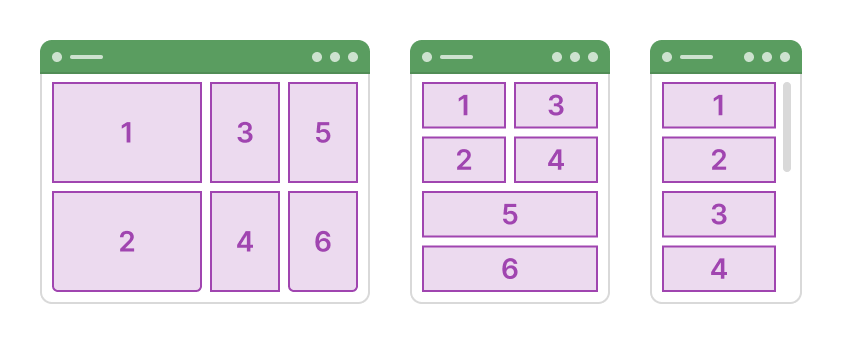
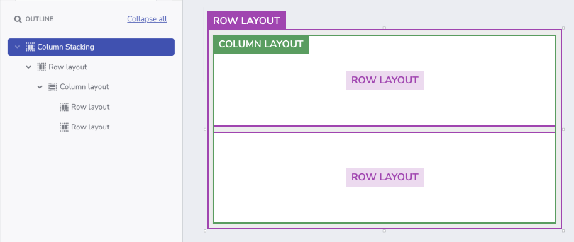
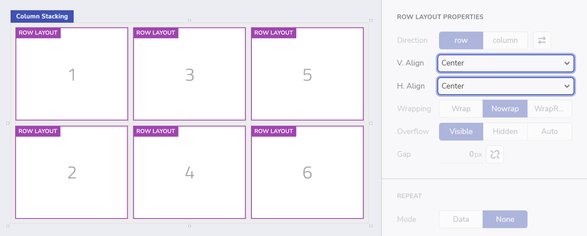
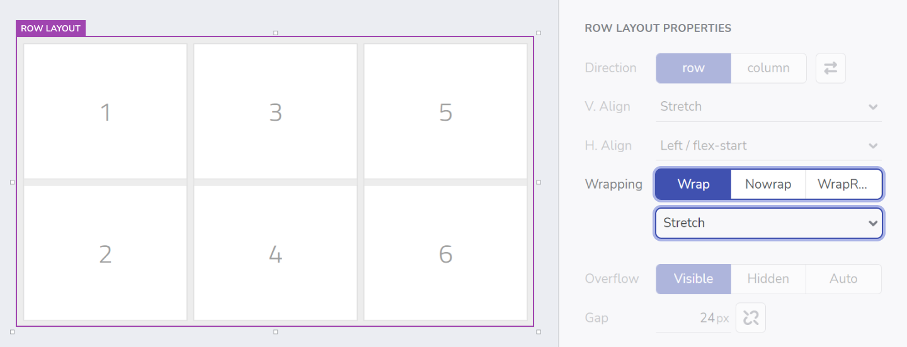
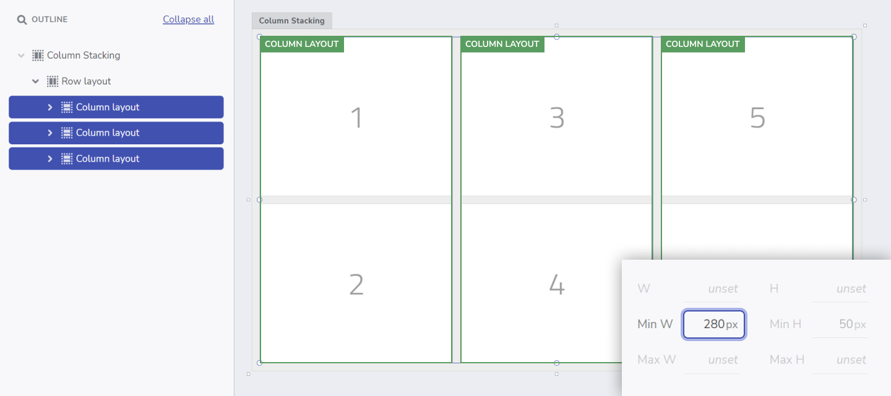
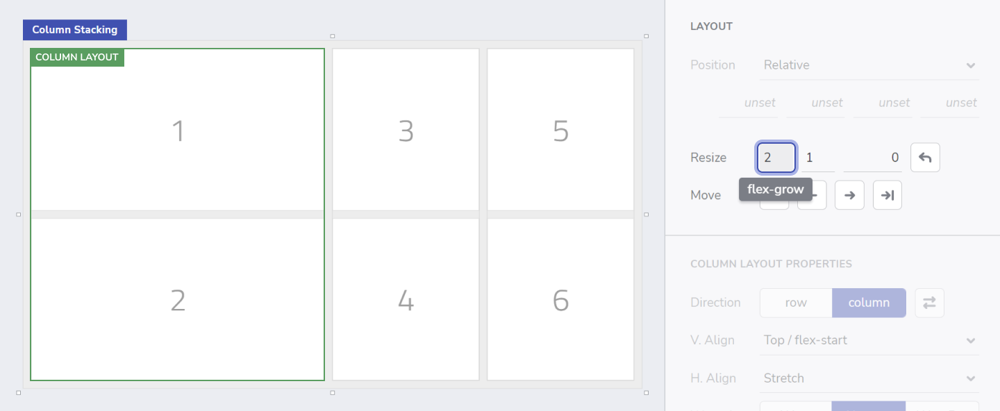
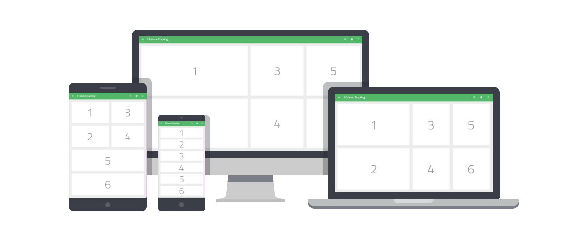

# レスポンシブ Fluid レイアウト
Fluid レイアウトは、作成するのが常に課題です。このミニチュートリアルでは、3カラムのレイアウトを素早く作成し、画面サイズが変わったときに**レスポンシブ**に動作するようにする方法を紹介します。

このチュートリアルでは、App Builder で Layout プロパティを使用して、この動的なスタック効果を実現する方法を示します。 
 

## **手順 1:** ベース レイアウトを作成する

- **[Blank]** テンプレートで **[新しいアプリ]** を作成します。 
- コンポーネント ツールボックスから、キャンバスに **[Row Layout]** を追加し、`[サイズ変更: 拡大]` を有効にします。  
- **Row Layout** の**外観**を設定します。
  - `パディング: 24px`
  - `間隔: 24px`
  - `Bg.Fill: Gray-200`
- **Row Layout** の中に、**[Column Layout]** を追加し、`[サイズ変更: 拡大]` を有効にします。その後、`間隔: 24px` を設定します。 
- 列の中に、2 つの **[Row Layout]** を追加し、両方とも `[サイズ変更: 拡大]` と `[Bg.Fill: White]` に設定します。
 

>**プロのヒント:** `Ctrl + E` / `Cmd + E` でいつでも新しいコンポーネントをキャンバスに追加でき、アプリの作成プロセスをスピードアップできます。
 

 

## **手順 2:** 3 列構造を作成する

- 子行が含まれる **Column Layout** をコピーし、2 回貼り付けて **[3 列のレイアウト]** を作成します。
- 各 **Row Layout** を簡単に識別できるように、以下のようにします。
  - 以下の図のような順番で、それぞれの中に **Title** コンポーネントを追加し、番号を付けます。 
  - 複数選択 (Shift + クリック) で 6 つの **Row Layout** をすべて選択し、`[縦配置: Center]` と `[横配置: Center]` を設定して配置を変更します。
 

 

## **手順 3:** 積み重ねの準備

- これらの 3 つの **Column Layout** を含む親 **Row Layout** を選択し、`[折り返し: Wrap]` を設定します。 
- 下のドロップダウンで、コンテンツの配置を `[Stretch]` に変更します。
 

 

## **手順 4:** 積み重ね

積み重ねるためには、**Row Layout** の中にある 3 つの **Column Layout** に最小幅を設定する必要があります。アプリをプレビューする際、ブラウザの幅を小さくすると、各列はその最小幅に達するまで縮小されます。この場合、`[折り返し: Wrap]` の設定により、子レイアウトが**積み重ねられます**。

- これを実現するには、3 つの列を選択し、それぞれに `[最小幅: 280px]` を設定します。
- アプリケーションを**プレビューして**、ブラウザーのサイズを変更したときに列が垂直方向にどのように積み重ねられるかを確認します。 
- また、ブレイクポイント セレクターを使用して、より小さなデバイスに切り替えることも可能です。
- **[編集]** をクリックして、アプリの編集を続行します。
 

 

## **手順 5:** さらに一歩踏み込んでみましょう!

最後に、1 列目を他の 2 列よりも広くします。そのために必要なことは、[サイズ変更] の設定を変更することです。 

- 1 列目を選択し、レイアウトのプロパティで、`[拡大]` と `[縮小]` の隣にある `[編集]` ボタンをクリックし、`flex-grow:2` を設定します。 

これにより、1 列目は他の 2 列目よりも 2 倍のスペース (水平方向) が確保されます。
 

 

## これで完了です。

3 つの異なる画面サイズでのアプリケーションの最終結果を次に示します。
[ライブアプリはこちら](https://appbuilder.indigo.design/app/ihyry6j7gpq5/preview)で確認できます。

* [App Builder コンポーネント](../indigo-design-app-builder-components.md)
* [フレックスボックス](https://developer.mozilla.org/ja-JP/docs/Learn/CSS/CSS_layout/Flexbox)
* [フレックスボックスのガイド](https://css-tricks.com/snippets/css/a-guide-to-flexbox/)
* [Flexbox Froggy](https://flexboxfroggy.com/)
* [Indigo.Design はじめに](https://jp.infragistics.com/products/indigo-design/help/getting-started)
* [Indigo.Design スタイル設定の概要](https://jp.infragistics.com/products/indigo-design/help/style/styling-overview)