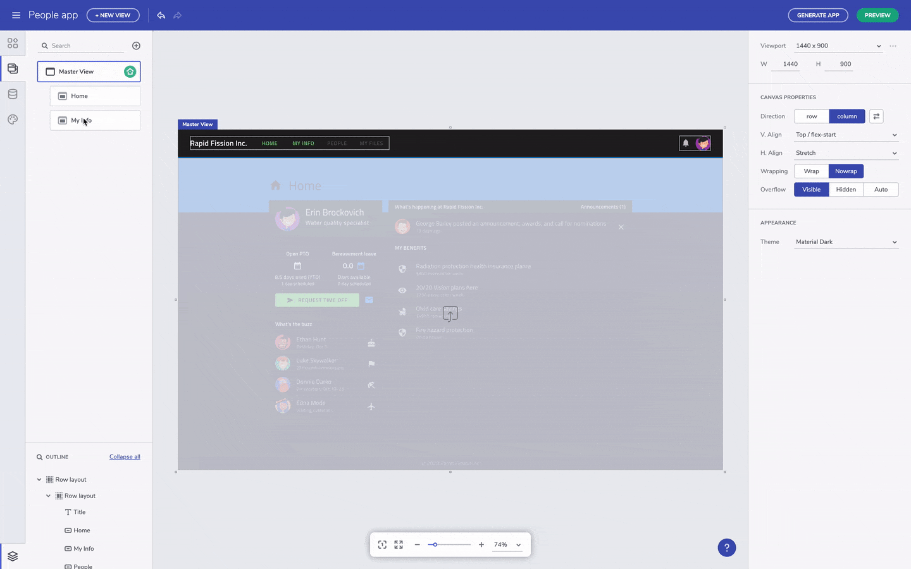
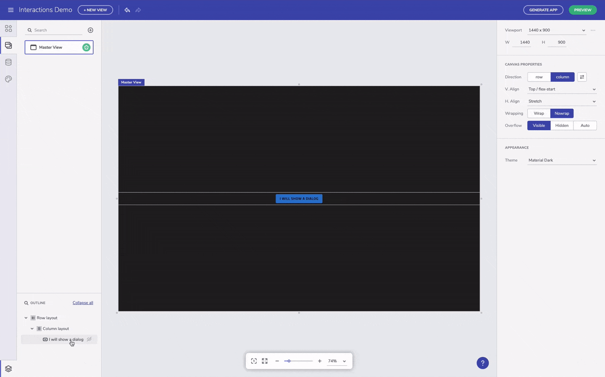

# インタラクション

> [!NOTE]
><b>Ignite UI App Builder のインタラクション機能を使用して、ビューとコンポーネント間の特定のインタラクション (他のビューへの移動、アプリ コンポーネントの表示/非表示、開く/閉じるなど) を定義できます。

### トピック コンテンツ:
* <a href="#はじめに">機能の紹介</a>
* <a href="#次へ移動">インタラクション: 次へ移動</a>
* <a href="#開く閉じるインタラクション">インタラクション: 開く/閉じる</a>
* <a href="#表示非表示 ">インタラクション: 表示/非表示</a>
* <a href="#その他のリソース">その他のリソース</a>

<section class="video-container">
    

        

            <iframe src="https://www.youtube.com/embed/zxT-nIXKn7I" frameborder="0" allowfullscreen></iframe>
        

        
インタラクション機能の紹介

    

</section>

## はじめに
Ignite UI App Builder を使用して、ユーザーはアプリケーションのレイアウトや画面をデザインできるだけでなく、アプリケーションのインタラクション デザインを定義できます。インタラクションは、コンポーネントとビュー間、またはコンポーネント間のみに設定できます。この機能により、ボタン コンポーネントのクリック時にトリガーされるカレンダー コンポーネントの表示や非表示など、特定のアプリケーション シナリオを確立できます。これにより、ユーザーはお客様のニーズに合わせて優れた UX フローを構築できます。追加されたすべてのインタラクションはプレビュー モードだけでなく、生成後のアプリケーション コードでも使用できます。
インタラクションを追加するには、最初にアクションをトリガーするコンポーネントを選択し、次に Ignite UI App Builder インターフェイスの右側のプロパティ パネルに移動してインタラクションまでスクロールします。次に、[+] アイコンボタンを選択して新しいインタラクションを作成します。これにより、以下で新しいインタラクションが作成されます。最初にインタラクション タイプを取得し、次にターゲット コンポーネントまたはビューを取得します。コンポーネントに追加できるインタラクションは 1 つのみです。作成したインタラクションはプレビュー モードでテストでき、インタラクション パネルで削除または編集できます。各インタラクションの使用方法については、以下の詳細な説明を参照してください。

## 次へ移動
「次へ移動」は、ユーザーの子またはマスター ビューによって選択されたコンポーネントへの接続を設定できる最も簡単で基本的なインタラクションです。コンポーネントを取得してインタラクションを作成し、宛先ビューを取得します。デザイン時は、インタラクションによってコンポーネントやビューに視覚的な変更は加えられません。 

「次へ移動」インタラクション

ビゲーション ルートのパラメーターを含む拡張ナビゲーションを作成する方法の詳細については、[ルート パラメーターを使用したナビゲーション](guide-to-variables-in-app-builder/route-parameters-navigation.md)を参照してください。

## 開く/閉じるインタラクション
開く/閉じるインタラクションは、Dialog などのオーバーレイ コンポーネントのみをターゲットにします。つまり、最初にトリガー コンポーネント (Button など) を追加し、次にオーバーレイ コンポーネント (Dialog など) をデザイン領域に追加する必要があります。ボタンとダイアログの例を使用して、次のステップはボタンを選択し、インタラクション パネルに移動してインタラクションを [開く/閉じる] を選択します。トリガーとオーバーレイが使用可能になると、開く/閉じるインタラクションのロックが解除され、ユーザーはボタンを選択して開くダイアログを選択できます。 

「開く/閉じる」インタラクション

Dialog コンポーネントを追加すると、デザイン領域のアクティブなビューの名前の隣にオーバーレイ通知が表示されます。オーバーレイをクリックして、使用可能なオーバーレイの 1 つを選択するとアクティブになります。その後、アプリケーション シナリオに従って編集できます。 

## 表示／非表示 
「表示/非表示」は、コンポーネントに適用できるインタラクションで、同じビューで別のコンポーネントの表示状態を表示または非表示にします。他のインタラクションと同様に、最初にインタラクションをトリガーするコンポーネントを選択し、次にターゲット コンポーネント (表示/非表示コンポーネント) を選択する必要があります。ターゲット アイコンの選択 (アクティブなインタラクションの隣) でターゲット コンポーネントを取得できます。これにより、マウス カーソルがターゲット アイコンに変わり、表示または非表示にするコンポーネントをクリックします。ターゲット コンポーネントが選択されると、カーソルは標準に戻ります。コンポーネントのターゲットをキャンセルするには、ESC をクリックします。インタラクションを適用できるコンポーネント上にカーソルがあり、このインタラクションをレイアウト コンポーネントまたはビュー全体に適用できない場合のみ、ターゲットが有効になります。適用したインタラクションを確認するには、プレビュー モードでテストします。

「表示/非表示」インタラクション

Ignite UI App Builder は常に新しいインタラクションで更新されますが、既存のインタラクションのユーザーエクスペリエンスも向上しています。改善のための質問や提案がある場合は、製品サポートまでお問い合わせください。

## その他のリソース

* [単一ページアプリとナビゲーション](single-page-apps-and-navigation.md)
* [Angular ルーティング](https://angular.io/start/start-routing)
* [App Builder コンポーネント](indigo-design-app-builder-components.md)
* [Flex レイアウト](flex-layouts/flex-layouts.md)
* [Desktop アプリの実行方法](running-desktop-app.md)
* [アプリを生成する](generate-app/generate-app-overview.md)
* [Indigo.Design はじめに](https://jp.infragistics.com/products/indigo-design/help/getting-started)
