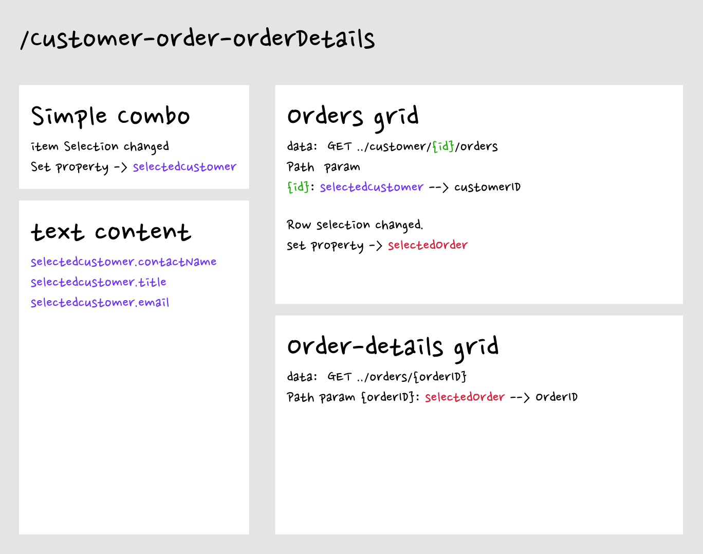
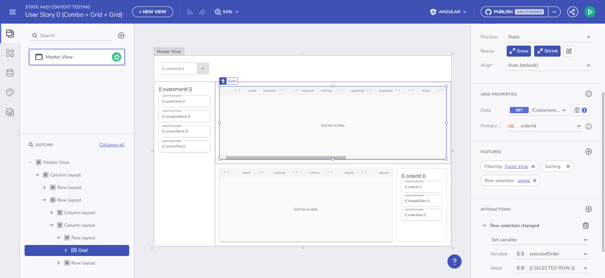

# 変数とイベントを備えたマスター/詳細スタイルのアプリ

当初、この機能はマスター/詳細設計インターフェイスの基本に従う予定でした。しかし、それはさらに進化しました。マスター/詳細パターンの本質については誰もがよく知っています。これは、レコードのリストを表示し、ユーザーがレコードを簡単に管理できるようにする方法です。通常、これは 2 つのビューで構成されます。1 つはレコードのマスター リストで、もう 1 つは単一レコードに関する拡張データを表示するために使用されます。

マスター/詳細の例

## App Builder のマスター/詳細パターンの重要な要素

この新しい機能は、マスター/詳細パターンによって確立される次の主要な要素をカバーします。  

- **プライマリ ペイン**: この領域には、他のアプリ コンポーネントの読み込みを開始する項目またはトリガーのリストが表示されます。
- **詳細ペイン**: さまざまなインタラクティブ コンポーネントを利用して、プライマリ ペインで選択した項目に関する詳細情報が表示されます。
- **インタラクション**: これらは、コンテキスト、ドリルダウン、ポップアップなど、マスター リスト ビューと詳細ビューの相互作用を定義します。

マスター/詳細 App Builder プレビュー

## マスター/詳細シナリオの実装

App Builder でマスター/詳細シナリオを作成するために、いくつかの機能を統合します。

## 変数管理のトピック

[変数管理](../guide-to-variables-in-app-builder/variables-management.md)でアプリの可能性を最大限に引き出します。グローバル変数とローカル変数を効果的に管理、活用し、データフローとインタラクティビティを向上させる方法について説明します。

## コンポーネント プロパティのバインド

[コンポーネント プロパティのバインド](../guide-to-variables-in-app-builder/component-properties-binding.md)を使用して、アプリのデータ バインドとユーザー エクスペリエンスを向上させます。動的でインタラクティブな UI のためにコンポーネントのプロパティをデータにバインドする方法を説明します。

## URL パラメーターのバインド

[URL パラメーターのバインド](../guide-to-variables-in-app-builder/url-parameters-binding.md)を詳しく調べて、データ フェッチを実行する方法について説明します。アプリケーションで効率的なデータ リクエストとリピーターを実現するための URL パラメーターの使用方法について説明します。

## イベントとアクションの操作

インタラクティブな UI デザインを実際に体験するには、[「イベントとアクションを操作する」](../guide-to-variables-in-app-builder/working-with-events-and-actions.md)をご覧ください。App Builder でイベントとアクションを利用して、魅力的で動的なユーザー インターフェイスを作成する方法を理解します。

## 既知の問題と制限

- **URL/クエリ パラメーター**: 現在、非スワッガー URL/クエリ パラメーターはデータの読み込みではサポートされていません。
- **グリッドのテンプレート化**: グリッドのテンプレート化の変数はまだサポートされていませんが、次のリリースでサポートされる予定です。
- **データ バインドの制限**: 単一オブジェクトの繰り返しデータとプリミティブの配列へのバインドはサポートされていません。
- **Combo コンポーネントに固有**: `valueKey` を使用した複数選択モードでは、プリミティブの配列を処理する必要がありますが、これはまだサポートされていません。
- **必須パラメーター**: 必須パラメーターを空のままにすることは許可されていますが、コンパイル エラーが発生する可能性があります。

## 重要ポイント

- **マスター/詳細 UI デザイン**: App Builder のマスター/詳細パターンを使用すると、動的でユーザーフレンドリーなインターフェイスを作成できます。
- **高度なデータ処理**: 変数、イベント、データ バインドを統合することで、高度なデータ管理が可能になります。
- **インタラクティブなコンポーネント**: さまざまなコンポーネントを利用することで、アプリケーションのインタラクティビティと機能性が向上します。
- **制限の認識**: 現在の制限を理解することは、アプリケーションの計画と開発をより効率的に行うのに役立ちます。

## その他のリソース

- [変数の管理](../guide-to-variables-in-app-builder/variables-management.md)
- [ルート パラメーターを使用したナビゲーション](../guide-to-variables-in-app-builder/route-parameters-navigation.md)

- [コンポーネント プロパティのバインド](../guide-to-variables-in-app-builder/component-properties-binding.md)
- [URL パラメーターのバインド](../guide-to-variables-in-app-builder/url-parameters-binding.md)
- [イベントとアクションの操作](../guide-to-variables-in-app-builder/working-with-events-and-actions.md)
- [ステップバイステップのアプリ作成例](step-by-step-examples.md)
- [App Builder コンポーネント](../indigo-design-app-builder-components.md)
- [Flex レイアウト](../flex-layouts/flex-layouts.md)
- [Desktop アプリの実行方法](../running-desktop-app.md)
