# 変数とイベントを備えたマスター/詳細スタイルのアプリ 

当初、この機能はマスター/詳細設計インターフェイスの基本に従う予定でした。しかし、それはさらに進化しました。マスター/詳細パターンの本質については誰もがよく知っています。これは、レコードのリストを表示し、ユーザーがレコードを簡単に管理できるようにする方法です。通常、これは 2 つのビューで構成されます。1 つはレコードのマスター リストで、もう 1 つは単一レコードに関する拡張データを表示するために使用されます。 


<p style="text-align:center;">マスター/詳細の例</p>

この新しい機能は、マスター/詳細パターンによって確立される次の主要な要素をカバーします。  

- プライマリ ペイン: 前に説明したように、項目のリスト、またはアプリの他の部分の読み込みを開始できるものを含む領域です。 
- 詳細ペイン: この領域には、プライマリ ペイン領域で選択した項目の詳細が表示されます。これは、提供されたデータに基づいてできるだけ多くの情報を表示することを目的として、相互に対話するさまざまなコンポーネントで構成されます。  
- インタラクションこれは、マスター内の項目とその詳細の間のインタラクションに関するものです。たとえば、マスター内の項目を選択すると、詳細がマスター ペインの隣のペインまたはポップアップに表示されたり、さらに多くのページをドリルダウンしたりできます。インタラクションは、コンテキスト、ドリルダウン、ポップアップに大まかに分類できます。  


<p style="text-align:center;">マスター/詳細 App Builder プレビュー</p>

**これらの各機能の詳細をご紹介しましょう。**

## 変数の管理  

簡単に言うと、以下を介してアプリケーション内のコンポーネント間でデータを受け渡すことができるようになりました。 

- グローバル変数 – ビュー間でデータを渡すために使用されます。  
- ローカル変数 – 同じビューのコンポーネント間でデータを渡すために使用されます。  

変数の型は、文字列、数値、ブール、日付、オブジェクト、配列です。 

どのプリミティブ型についても、値エディターを使用してデフォルト値を指定できます。配列およびオブジェクトについては、フライアウト メニューからエンドポイントまたはスキーマ 型を選択できます。アプリで利用可能なデータ ソース スキーマに基づいてそれらをリストします。 

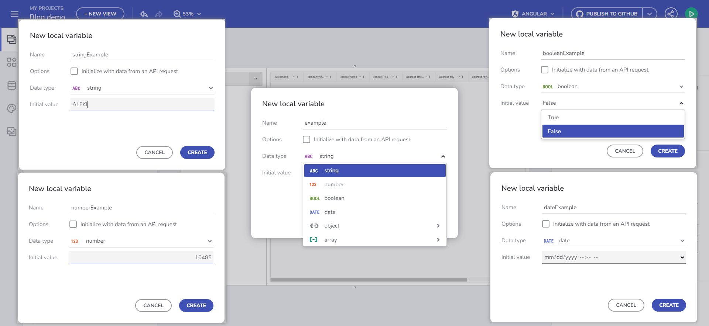
<p style="text-align:center;">変数の管理</p>

使い方:
- 変数の作成 - コンポーネントの [インタラクション] セクションまたは [ビュー] プロパティーパネルの [数] セクションを使用します。 
- 変数の削除 - 変数をクリックするか ([変数] セクション)、変数を右クリックしてコンテキスト メニューから [削除] を選択すると、変数を削除できます。 
- 変数の編集 – 変数をクリックするだけで変更を開始できます。ここでもチップを右クリックすると、同じコンテキスト メニューが利用可能になります。 

**変数の操作を開始するには 2 つの方法があります:** 

### インタラクション セクション
変数を使用する特定のコンポーネント イベントの [インタラクション] セクションを通じて変数を管理できるようになりました。

たとえば、Financial -> Box Office Revenue テーブルにバインドされたコンボを追加し、変数の設定アクションを使用して選択変更イベント ハンドラーを追加した場合、変数フィールドを選択して [+ 新しい変数] ボタンを使用できます。  

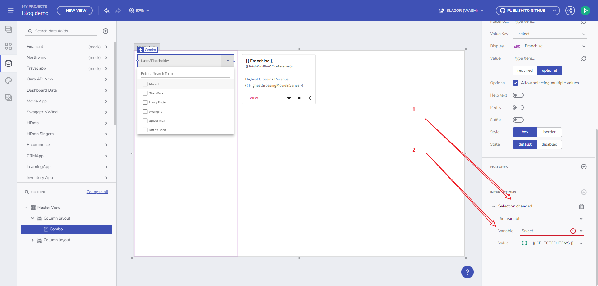
<p style="text-align:center;">コンポーネントのイベント ハンドラー経由</p>


これをクリックすると、コンボ データ ソースの型 (Box office revenue) と コンボ選択モードに基づいて、データ型がすでに入力された状態で [新しい変数] ダイアログが開きます。なぜでしょう？単一選択モードが指定されている場合、変数は単一のオブジェクト (Box office revenue) を使用することが期待されます。複数選択モードを使用する場合は、この場合と同様に、オブジェクトの配列 (Box office revenue の配列) を使用する必要があります。  

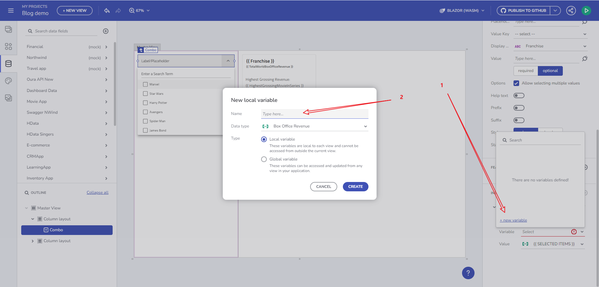
<p style="text-align:center;">新しい変数のダイアログ</p>

これはアプリケーションのライフサイクル作成の一部であるため、変数作成の主なフローと見なされます: 

.. コンポーネントから始めます

.. データにバインドします

.. イベントを追加します

.. 特定のアクションに固定する (Set Variable アクション)

.. 状態を保存する変数を作成します

.. この変数を後でアプリ内で使用します

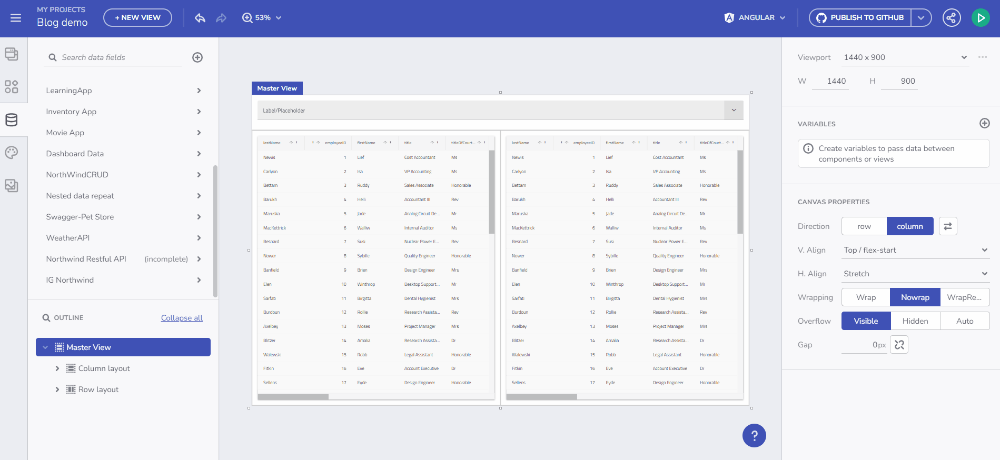
<p style="text-align:center;">ユーザー フローのビデオ</p>

### [変数] セクションで変数を作成します。 

そこからダイアログを開いて変数を作成および編集できます。命名プロセスをガイドする検証が用意されています。変数の型を設定するには 2 つの方法があります。ドロップダウン メニューで事前定義された型として指定する方法と、API リクエストからの自動初期化 (エンドポイントの選択による) による方法です。このオプションを使用すると、選択したエンドポイントのスキーマ データ型に基づいてデータ型が自動的に選択されます。  

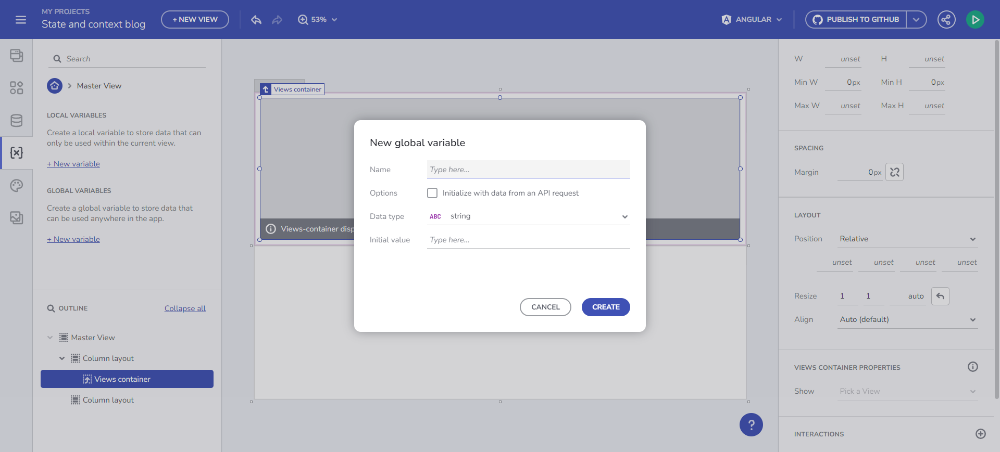
<p style="text-align:center;">変数の作成</p>

以下のセクションでは、変数の使用方法について詳しく説明します。 

### エンドポイントからのデータの初期化 

データを変数に保存し、既存のコンポーネントのデータ コンテキストで使用できるようになりました。また、選択したエンドポイントに基づいて、変数の型が自動的に検出されます。その情報はデータ スキーマから取得します。 

例を見てみましょう。/Customers エンドポイント リクエストからデータを取得し、後でそれを Combo コンポーネントにバインドしたい場合、これを簡単に実現できます。変数の作成中に、「API リクエストからのデータで初期化する」チェックボックスをクリックします。これにより、Customers の配列が取得されます。 

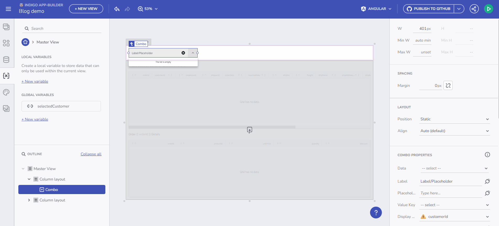
<p style="text-align:center;">エンドポイントからのデータの初期化</p>

### コンポーネント イベント コンテキストまたはデータ コンテキストを通じて変数値を設定します。  

この機能を使用すると、空の変数にデータを動的に入力できます。まず、Customers 配列型の空の変数を作成します。これを行うには、[変数の作成/編集] ダイアログから [データ型] ドロップダウンを開き、[配列] 項目を選択してからデータ ソースを選択します。この例の場合、それは /Customers になります。変数に `selectedCustomers` という名前を付けます。以下の gif は、このような変数を作成し、コンボの値選択が変更されたときにデータの入力を開始する方法を示しています。このシナリオの最後のステップは、Grid コンポーネントを、たとえば `selectedCustomers` 配列にバインドすることです。 

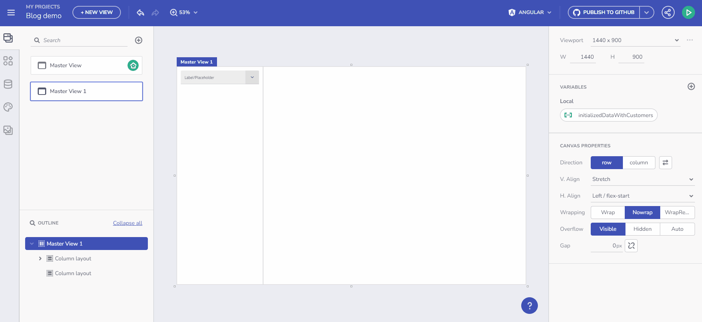
<p style="text-align:center;">イベントおよびデータ コンテキストの例</p>

同様のシナリオが次の「コンポーネントへのバインド」セクションの一部としてリストされていますが、変数値の設定ではなくプロパティのバインドに焦点が当てられます。 

## 拡張バインド オプション 

コンポーネントにバインドするとは、コンポーネント構成の実際のプロパティにバインドすることを意味します。実際のバインドは、バインド可能なコンポーネントの各プロパティに表示されるプラグ アイコンを通じて行われます。次の例を見てみましょう。以前は、Card コンポーネントのタイトルとサブタイトルを設定するには、データの配列を反復処理する必要がありました。そうすることで初めて、特定のデータ フィールドを設定できるバインド オプションとしてデータ コンテキストが表示されます。現在、変数は、データが繰り返されるコンテキストだけでなく、任意のコンポーネントをバインドできるコンテキストを提供するため、任意の型の変数を作成し、データ リピーターなしで単純なカードにバインドできます。  

### 配列型の変数を介して繰り返されるデータ 

映画 (Movies) のコレクションがあり、実行した複数の選択に基づいて最も興行収入の高い映画 (Box Office Movies) の詳細リストを表示したいと想像します。どうすればよいですか？  

- Movies コレクションを複数の選択機能 (Combo) を持つコンポーネントにバインドし、上で説明したイベント ハンドラーと変数の設定アクションを追加するフローに従います。 


<p style="text-align:center;">配列型の変数</p>

- Box Office Revenue 型の空の配列変数を作成します。データ型は、Combo コンポーネントに提供されたデータ ソースに基づいて事前に入力されます。 

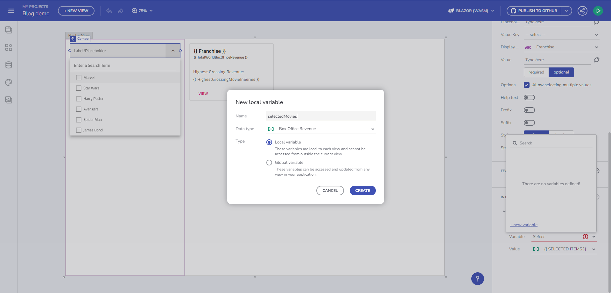
<p style="text-align:center;">新しい変数のダイアログ</p>

- カード コンポーネントを追加し、新しく作成した変数 「selectedMovies」 にバインドします。Title プロパティと Subtitle プロパティをデータ コンテキストのデータ フィールドにバインドします。 

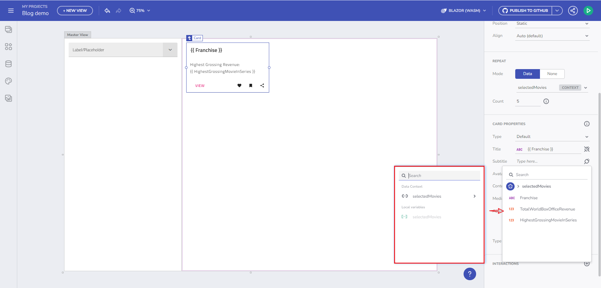
<p style="text-align:center;">データ コンテキストのバインド</p>

変更の結果は次のとおりです。 

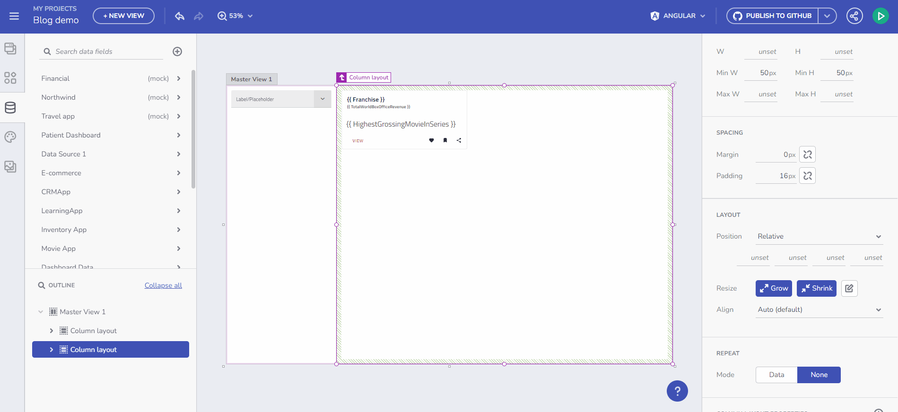
<p style="text-align:center;">結果</p>

### グローバル変数を使用したクロスビュー通信

- グローバル変数は、ビュー間でデータを渡すために使用されます。
- ローカル変数は、同じビューのコンポーネント間でデータを渡すために使用されます。  

これは、異なるマスター ビューと子ビューでグローバル変数を使用できることを意味します。1 つのビューでグローバル変数を作成すると、他のすべてのビューでも同様に表示されます。 

## データ リクエストとリピーターの URL パラメーター バインド 

### データ リクエスト 

パス/クエリ パラメーターを必要とするデータ エンドポイントを指定する場合、それらを指定できるようになり、指定されると、指定されたパラメーターに基づいてデータ リクエストが作成され、データが取得されます。「CustomerID」 パスパラメータに基づいて顧客の注文にバインドされた Grid の例 

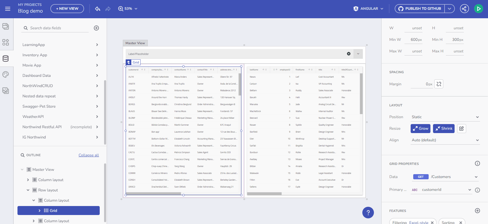
<p style="text-align:center;">データ リクエスト</p>

### データ リピーター 

別の例としては、選択された顧客 ID に基づいてフェッチされた Orders コレクションを通じて Tree ノード コンポーネントを繰り返すことが考えられます。違いを観察してください。今度はそれをデータ リピート コンテキストにバインドします。 

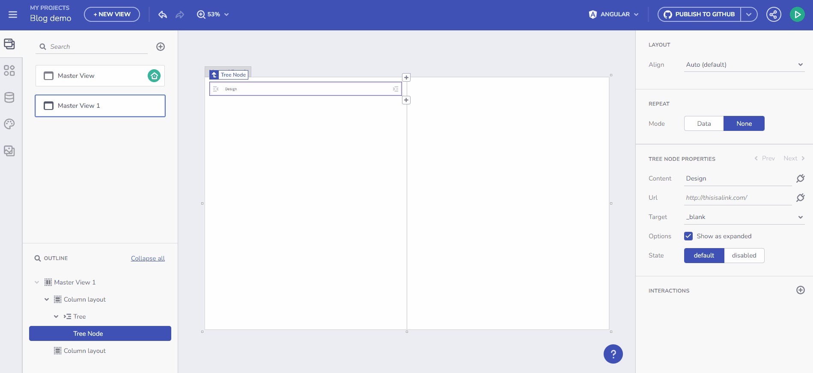
<p style="text-align:center;">データ リピーター</p>

## イベントの使用 

現在、変数管理のコンテキストで使用できるコンポーネント イベント ハンドラーを公開しています。そのようなイベントは次のとおりです。 

- 選択変更イベント - Combo コンポーネントの場合 
- 行選択変更イベント - Grid コンポーネントの場合   
- クリック イベント - クリック イベントで変数を設定するためのデータ コンテキスト (ツールボックス内のすべての既存のコンポーネントの場合)。 

Grid コンポーネントと Combo コンポーネントは選択モードを設定する方法を公開しており、選択モードに基づいて変数型を動的に変更します。 

例を見てみましょう。単一選択モードで顧客の配列にバインドされた Combo コンポーネントは、選択された項目のイベント コンテキストを介して Customer オブジェクトを渡します。 

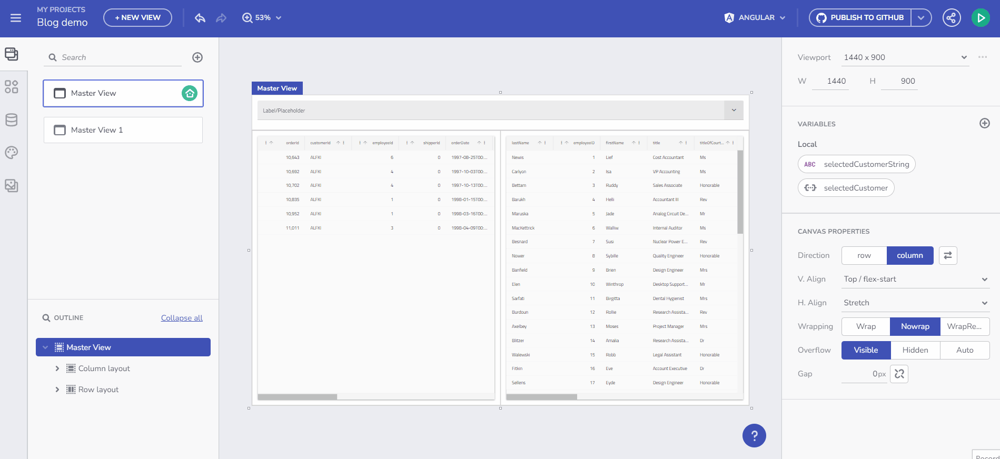
<p style="text-align:center;">イベントの使用</p>

App Builder のすべてのコンポーネント部分には、変数のコンテキストで使用できる OnClick イベント ハンドラーがあります。選択項目の場合、繰り返しデータがバインドされている場合、[クリック時] -> [変数の設定] のアクションを通じて特定の項目のデータ コンテキストにアクセスし、それを使用して変数値を変更できます。以下はツリーの例です:  

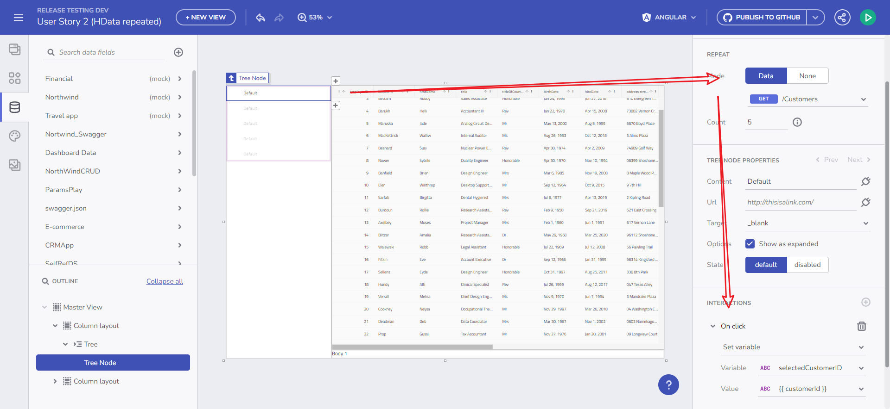
<p style="text-align:center;">クリック時の例</p>

`valueKey` を設定した場合の Combo の使用に関するメモ。コンボの仕組みは、選択変更のイベントでプリミティブ値を渡すことです。たとえば、CustomerID が設定されている場合は Number を渡し、CustomerName が設定されている場合は文字列を渡します。 

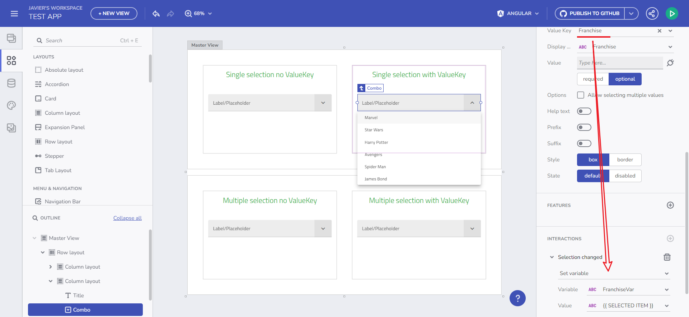
<p style="text-align:center;">コンボ値のキー ノート</p>

## 既知の問題と制限

- 非スワッガー URL/クエリ パラメーターのサポート - 当面は、クエリ/パス パラメーターからデータをロードすることはできません。
```
GET   /posts/1/comments
GET   /comments?postId=1
```
- Blazor および Web Components のグリッド テンプレートでの変数の使用は、現在サポートされていません。
- コンポーネントを 1 つのオブジェクトの繰り返しデータにバインドすることは、コード生成時にはサポートされません。
- Combo コンポーネントの詳細:
   - 複数選択モードと指定された `valueKey` プロパティを組み合わせた場合は、プリミティブの配列を処理するための変数が必要になりますが、これは現在 App Builder やコード生成ではサポートされていません。コンボ複数選択の際、`SelectionChanged` イベントは `valueKey` 型の配列を受け取ります。
- コンポーネントをプリミティブの配列にバインドすることは現在サポートされていません。
- AppBuilder では必須パラメーターを空のままにすることが許可されています。デフォルト値を設定することでコード生成が可能になります。これにより、エラー状態が発生し、警告が通知されますが、アプリのコード生成は停止されず、コンパイル エラーが発生する可能性があります。


## その他のリソース

<div class="divider--half"></div>

* [ステップバイステップのアプリ作成例](step-by-step-examples.md)
* [App Builder コンポーネント](../indigo-design-app-builder-components.md)
* [Flex レイアウト](../flex-layouts/flex-layouts.md)
* [Desktop アプリの実行方法](../running-desktop-app.md)