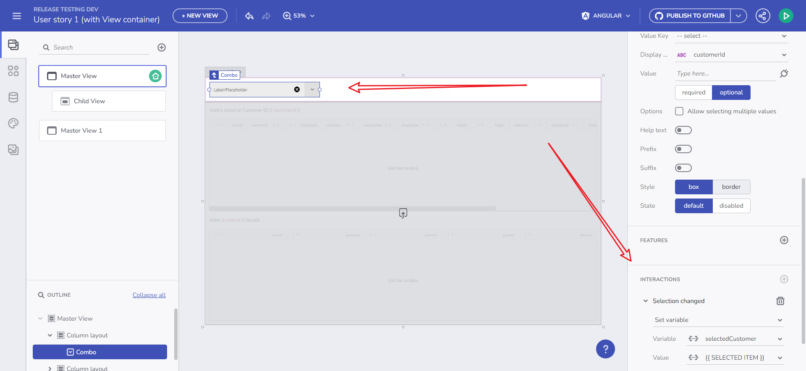
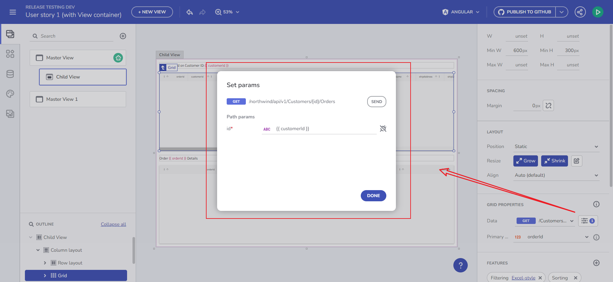
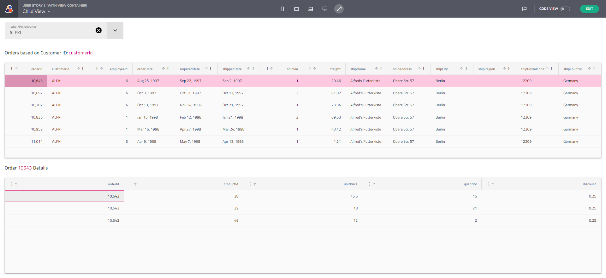
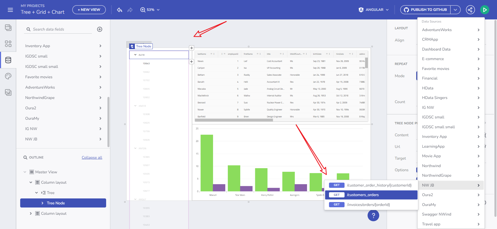
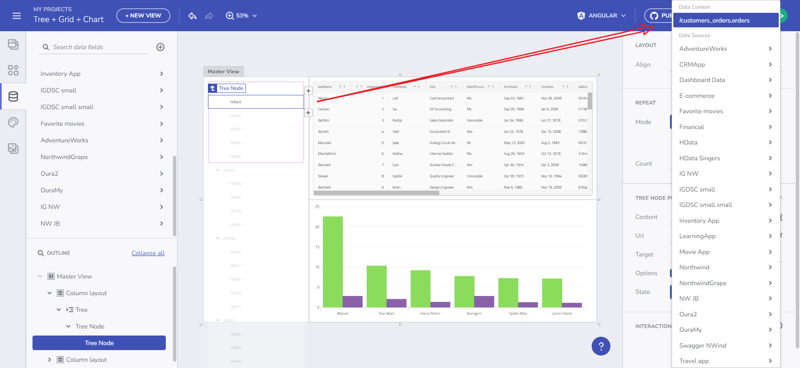
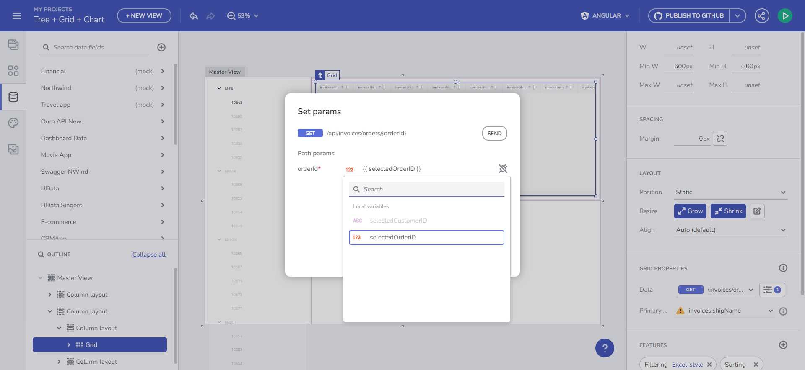
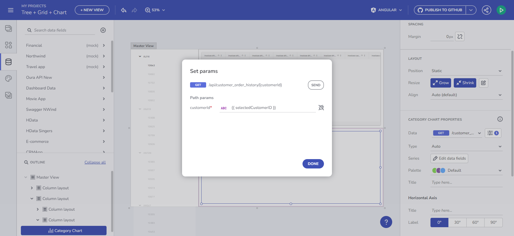
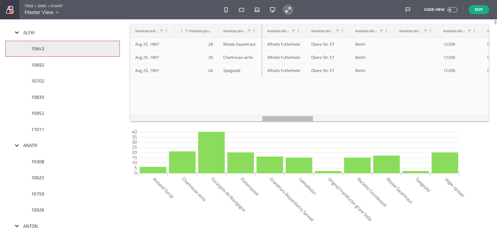

# ステップバイステップのアプリ作成例

以下に 2 つのシナリオの実際の使用例を示します。これらのシナリオでは、[状態とコンテキストの管理機能セットのメイン トピック](master-detail.md)で説明した内容がすべてカバーされます。

> [!NOTE]
> 以下のチュートリアルでは、[Northwind WebAPI](https://data-northwind.indigo.design/swagger/index.html) を使用します。

## 例 1

あるビューから設定されたグローバル変数と、ビュー コンテナを介した別のビューからのグリッド リクエストの更新

<a href="https://my.appbuilder.dev/app/bea0uqmjezxn/preview" target="_blank">ライブ デモ</a>

1. コンボ選択変更イベント時に設定されるグローバル変数を追加します。コンボは Customer エンドポイントにバインドされています。
2. コンボから CustomerID を選択します。
3. 他のビューに移動します。そこでは、グリッドが CustomerID に基づいて注文を取得する API リクエストにバインドされています。
4. グリッドは、(コンボから) 選択した CustomerID で更新する必要があります。

選択変更のイベント

CustomerID 変数

1. Orders グリッドから Order をクリックすると、OrderDetails を含む別のグリッドを読み込みます。

2. 結果

   
   
結果

## 例 2

グリッドとチャートのデータを読み込む階層データ ソースにバインドされたツリー

<a href="https://my.appbuilder.dev/app/jj15bv7rgkw8/preview" target="_blank">ライブ デモ</a>

1. Tree コンポーネントを追加し、その親を階層データ ソース (繰り返しデータ コンテキスト) にバインドします。
2. 親ツリー ノードのクリック時イベントを、CustomerID - 文字列変数を格納する変数設定アクションにバインドします。

   
   
ツリー ノードのバインド

3. ツリー子ノードを追加し、親データ コンテキストに繰り返します。子ツリー ノードのクリック時イベントを、OrderID - Number 変数を格納する変数の設定アクションにバインドします。

   
   
子ノードのバインド

4. ルート ツリー要素に Customer が表示され、子ツリー ノードに Orders が表示されていることを確認します。

5. OrderID 変数に基づいてクエリ パラメーターとして Orders を取得するエンドポイントに Grid をバインドします。

   
   
グリッドを Orders データにバインドする

6. CustomerID 変数に基づいて Customer Orders History をクエリ パラメーターとして取得するエンドポイントにチャートをバインドします。

   
   
チャートを Customer Orders History テーブルにバインドする

7. 結果

   
   
ツリー + グリッド + チャートの結果

