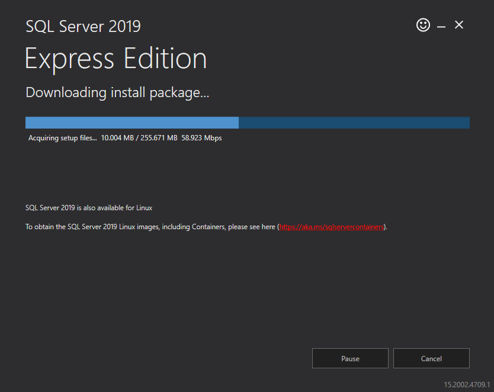
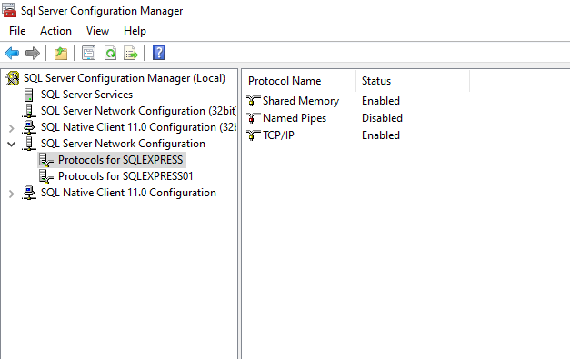
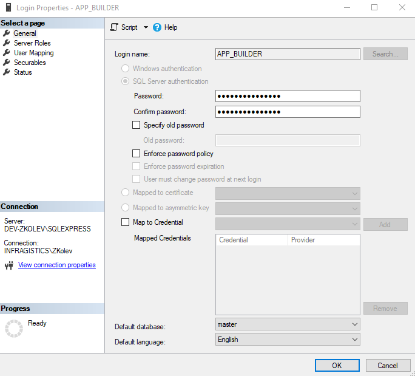
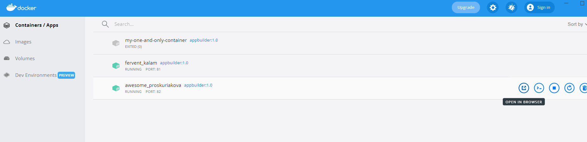
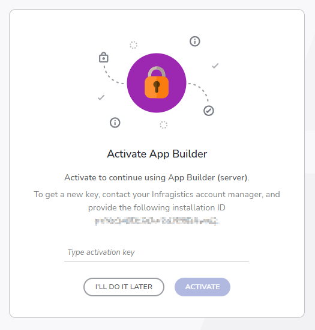

# App Builder オンプレミスの前提条件とインストール

## 前提条件

このセクションでは、オンプレミス バージョンの App Builder をインストールするための前提条件を示し、Linux/Mac OS/Windows を維持およびサポートする操作パラメーターを構成するシステム管理者を対象としています。

### SQL Server をインストール

1 - [SQL Server](https://www.microsoft.com/ja-jp/sql-server/sql-server-downloads) ([直接リンク](https://go.microsoft.com/fwlink/?linkid=866658)) をインストールします。


<p style="margin-top:-20px;width: 56%; text-align:center;">オンプレミス SQL Express のインストール</p>

> 注: オンプレミス サーバーには、VS の組み込み SQL Server Express ではなく、実際の SQL Server が必要です。

2 - tcp/ip を有効にするための詳細な説明は[こちら](https://docs.microsoft.com/ja-jp/sql/database-engine/configure-windows/enable-or-disable-a-server-network-protocol?view=sql-server-ver15#to-enable-a-server-network-protocol)にあります。


<p style="margin-top:-20px;width:56%; text-align:center;">SQL Server 構成マネージャー</p>

3 - Sql Express の新しい App_Builder ユーザー部分を追加します。[SQL Server Management Studio をインストールして](https://docs.microsoft.com/ja-jp/sql/ssms/download-sql-server-management-studio-ssms?view=sql-server-ver15)、その目的に使用できます。


<p style="margin-top:-20px;width: 57%; text-align:center;">ログイン パラメーター ダイアログ</p>

### Docker をインストール

Windows ガイド -> [docs.microsoft.com guide](https://docs.microsoft.com/ja-jp/virtualization/windowscontainers/quick-start/set-up-environment?tabs=Windows-10-and-11#tabpanel_1_Windows-10-and-11)

## インストール
このセクションでは、Docker と SQL サーバー データベースが既にインストールされていることを前提としています。

### 初回インストール

1 - [Infragistics カスタマー ポータル](https://account.infragistics.com/downloads)の下のダウンロード セクションの appbuilder.zip 部分をダウンロードします。

2 - appbuilder.zip ファイルに含まれている appbuilder.tar を抽出します。 

3 - 抽出した場所でターミナルまたはコマンド プロンプト ウィンドウを開きます。

4 - 画像を読み込んで確認します。

以下を実行します:

```
docker load --input appbuilder.tar
```

画像が正しく読み込まれていることを確認するには、次の表の例を参照してください:

```
docker images
```

| リポジトリ    | タグ               | 画像 ID          | 作成日                                   |サイズ   |
| --------:     | ----------------  | ----------------- | ---------------------------------------   |-----  |
| appbuilder    | 1.0               | 2a05977e039b      |12 days ago                                |854MB  |

5 - コンテナーを実行します:

```
docker run --restart always -p 80:5000 -e "ConnectionStrings:AppBuilderConnection=Data Source=<your-sql-database-ip>,<your-sql-database-port>;Database=<your-sql-database-name>;User ID=<your-sql-database-user>;Password=<your-sql-database-password>;Connect Timeout=15;Encrypt=False;TrustServerCertificate=False;ApplicationIntent=ReadWrite;MultiSubnetFailover=False" -v <external-folder-for-logs>:/appbuilder/logs -v <external-folder-for-storage>:/appbuilder/storage --name appbuilder appbuilder:1.0
```

6 - ブラウザーを開き、`http://localhost/` と入力します。

> [!NOTE]
> Docker Desktop を使用している場合は、Containers/Apps に移動し、コンテナーを見つけ、[Open in browser] をクリックします。


<p style="margin-top:-20px;text-align:center;">Docker の Containers/Apps</p>

### 更新

1 - 新しく公開された zip ファイルを使用して、初回インストールの最初の 4 つの手順に従います。

2 - 新しい画像が正しく読み込まれたことを確認します (古い画像は <none> としてタグ付けする必要があります)。

```
docker images
```


| リポジトリ        | タグ       | 画像 ID          | 作成日       |サイズ   |
| --------:         | --------- | ----------------- | ------------- |-----  |
| appbuilder        | 1.0       | 27ff4c1079ac      | 43 hours ago  |932MB  |
| <none>            | <none>    | 2a05977e039b      | 12 days ago   |854MB  |
        
3 - コンテナーを停止します。

```
docker stop appbuilder
```

4 - コンテナーを削除します。

```
docker rm appbuilder
```

5 - 初回インストールの手順 5 で使用したコマンドと同じコマンドでコンテナーを実行します。


## アクティブ化
このセクションでは、オンプレミス インスタンスが既にインストールされており、実行していることを前提としています。

サーバーが最初に起動されると、プロンプト ダイアログにインストール ID が表示され、認証キーが要求されます。このインストール ID をお住まいの地域に基づいて[セールス部門](https://jp.infragistics.com/about-us/contact-us#sales)に送信すると、サーバーをアクティブ化するための認証キーが提供されます。



<p style="margin-top:-20px;width:36%;text-align:center;">App Builder をアクティブにする</p>

> [!NOTE]
> キーの有効期限が切れる 30 日前に、UI から直接警告メッセージが表示されます。

## トラブルシューティング
### Windows 上の Docker Desktop
[Windows 上の Docker Desktop は、Windows マシンにログインしないと自動的に起動しない問題](https://github.com/docker/for-win/issues/6670) - Docker チームは、プロダクション ワークロードに Docker Desktop を推奨していません。Windows コンテナーが必要な場合は、Linux ボックスでは Docker を使用するか、Windows Server では Docker を使用する必要があります。


## その他のリソース
<div class="divider--half"></div>

* [App Builder インターフェイスの概要 ](interface-overview.md)
* [単一ページアプリとナビゲーション](single-page-apps-and-navigation.md)
* [App Builder コンポーネント](indigo-design-app-builder-components.md)
* [Flex レイアウト](flex-layouts/flex-layouts.md)
* [Desktop アプリの実行方法](running-desktop-app.md)
* [アプリを生成する](generate-app/generate-app-overview.md)
* [Indigo.Design はじめに](https://jp.infragistics.com/products/indigo-design/help/getting-started)

