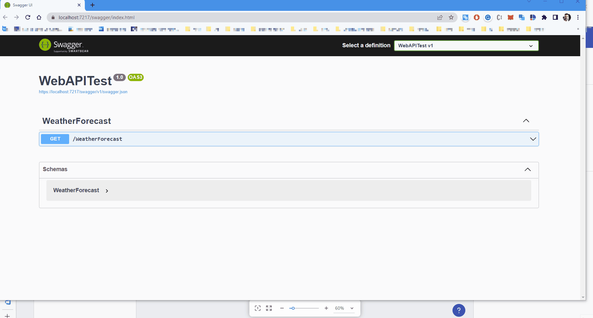

# OpenAPI (Swagger) サポート

Swagger ツールの力は、RESTful API の設計の業界標準である OpenAPI 仕様から始まります。

## Swagger の概要

**Swagger** は、OpenAPI 仕様を最大限に活用するための最も強力で使いやすいツールを提供します。これらのツールは、REST API の設計、構築、文書化、および使用に役立ちます。

## OpenAPI の概要

**OpenAPI 仕様** (以前の Swagger 仕様) は、REST API の API 記述形式です。OpenAPI ファイルを使用すると、次のような API 全体を記述できます:

- 使用可能なエンドポイント (/users) と各エンドポイントでの操作 (GET /users, POST /users)

エンドポイントの設定

- 操作パラメーター各操作の入力と出力

エンドポイント パラメーター / アプリの設定

- 認証方法
- 連絡先情報、ライセンス、利用規約およびその他の情報

API 仕様は YAML または JSON で記述できます。このフォーマットは習得が容易で、人間と機械の両方が読みやすくなっています。完全な OpenAPI 仕様は、GitHub にあります: [OpenAPI 3.0 の仕様](https://github.com/OAI/OpenAPI-Specification/blob/master/versions/3.0.3.md)。OpenAPI の詳細については、[こちら](https://swagger.io/docs/specification/about/)をご覧ください。

Swagger のデモ

## Swagger 定義を指定

この時点で、Swagger ファイルの URL (json/yaml) を指定するか、定義をアップロードすることができます。読み込まれると、[エンドポイントの設定] が表示されます。

[エンドポイントの設定] ダイアログの左側には、次のものがあります:
- [ベース URL] - その値がファイル定義に存在する場合、自動的に入力できます
- [認証] - 必要に応じて認証キーを提供します 
- エンドポイント ツリー ビュー - 使用可能なすべてのエンドポイントが、そのタイプ (GET、PUT、POST など) とともにここに読み込まれます

[エンドポイントの設定] ダイアログの右側は、次のものがあります:
- 接続を選択する前に接続をテストするために使用できる [送信] ボタンを使用して URL をリクエストします
- [認証]、[パラメーター]、[ヘッダー] のタブ要素 - 必要な場合は、そのようにマークされます。
- 情報メッセージまたは必須フィールドを表示するタブ コンテンツ セクション。画像の例:

[エンドポイントの設定] ダイアログ

## ローカル ネットワーク ソースからのデータ ソースの使用
これで、ローカル ホストまたはプライベート ネットワークにリクエストを送信できます。詳細については、「アプリでデータを使用する」トピックの[プライベート ネットワークの使用セクション](using-data-in-your-app.md#using-data-source-from-local-network-sources)の部分をご覧ください。

ローカル ネットワーク ソースの使用

## その他のリソース

* [App Builder コンポーネント](indigo-design-app-builder-components.md)
* [App Builder インターフェイスの概要 ](interface-overview.md)
* [単一ページアプリとナビゲーション](single-page-apps-and-navigation.md)
* [App Builder コンポーネント](indigo-design-app-builder-components.md)
* [Flex レイアウト](flex-layouts/flex-layouts.md)
* [Desktop アプリの実行方法](running-desktop-app.md)
* [アプリを生成する](generate-app/generate-app-overview.md)
* [Indigo.Design はじめに](https://jp.infragistics.com/products/indigo-design/help/getting-started)