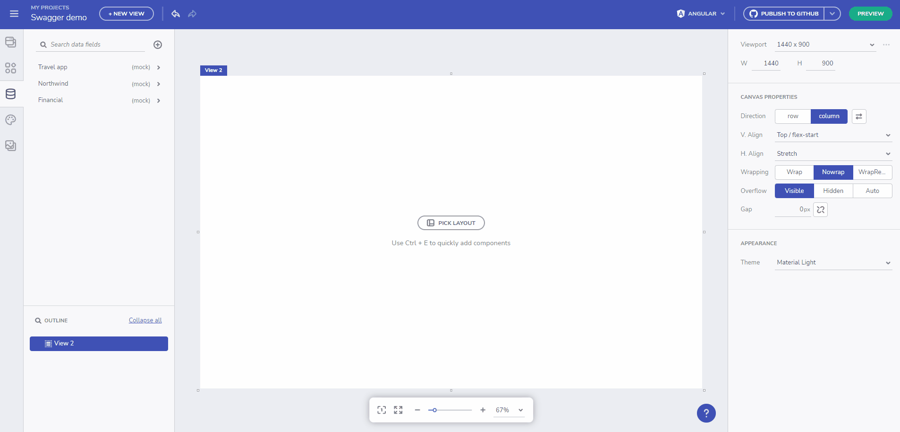

# OpenAPI (Swagger) Support

The power of Swagger tools starts with the OpenAPI Specification — the industry standard for RESTful API design

## Swagger Overview

**Swagger** offers the most powerful and easiest to use tools to take full advantage of the OpenAPI Specification. These tools can help you design, build, document and consume REST APIs.

## OpenAPI Overview

**OpenAPI Specification** (formerly Swagger Specification) is an API description format for REST APIs. An OpenAPI file allows you to describe your entire API, including:

- Available endpoints (/users) and operations on each endpoint (GET /users, POST /users)

Configure Endpoints

- Operation parameters Input and output for each operation

Set Endpoints Parameters/Apps

- Authentication methods
- Contact information, license, terms of use and other information

API specifications can be written in YAML or JSON. The format is easy to learn and readable to both humans and machines. The complete OpenAPI Specification can be found on GitHub: [OpenAPI 3.0 Specification](https://github.com/OAI/OpenAPI-Specification/blob/master/versions/3.0.3.md). More about OpenAPI [here](https://swagger.io/docs/specification/about/).

Swagger demo

## Specify Swagger definition

At this point you can either specify a _Swagger file URL_ (json/yaml) or _Upload a definition_. Once loaded a _Configure endpoints_ will appear.

The left-side of the _Configure endpoints_ dialog consists of:
- Base URL - can be automatically populated if value for it is present in the file definition
- Authorization - provide auth key if needed
- Endpoints tree view - All available endpoints will be loaded here along with its type (GET, PUT, POST and etc.)

The right-side of the _Configure endpoints_ dialog consists of:
- Request url with _Send_ button that can be used to test the connection before selecting it
- Tab elements for authorization, parameters and headers - if one is required, it will be marked as such.
- Tab content section showing _info_ messages or required fields. Example image:

Configure Endpoints Dialog

## その他のリソース

* [App Builder コンポーネント](indigo-design-app-builder-components.md)
* [App Builder インターフェイスの概要 ](interface-overview.md)
* [単一ページアプリとナビゲーション](single-page-apps-and-navigation.md)
* [App Builder コンポーネント](indigo-design-app-builder-components.md)
* [Flex レイアウト](flex-layouts/flex-layouts.md)
* [Desktop アプリの実行方法](running-desktop-app.md)
* [アプリを生成する](generate-app/generate-app-overview.md)
* [Indigo.Design はじめに](https://jp.infragistics.com/products/indigo-design/help/getting-started)