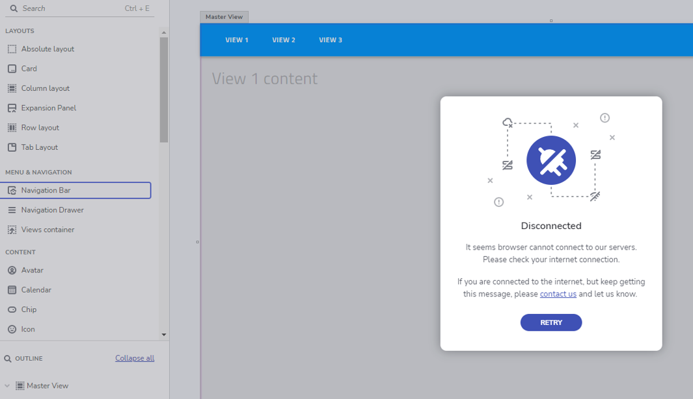

## Desktop アプリの実行方法
あらゆるデバイスでアプリといつでも接続できます。どこにいてもすぐに作業にアクセスできます。App Builder は、モバイル、デスクトップ、またはウェブでデザインされているため、外出先でも、どのデバイスからでもチームの可能性を最大限に引き出すことができます。

- [Windows インストーラー](https://github.com/IgniteUI/app-builder-client/releases/latest/download/AppBuilder.exe)
- [MacOS インストーラー](https://github.com/IgniteUI/app-builder-client/releases/latest/download/AppBuilder.dmg)
- [Linux インストーラー](https://github.com/IgniteUI/app-builder-client/releases/latest/download/AppBuilder.AppImage)

## トラブルシューティング

### Linux インストーラー
Linux で <b>AppBuilder.AppImage</b> ファイルをダウンロードすると、デフォルトでは実行できない場合があることに注意してください。したがって、それを実行できるようにするには、以下のステップを実行する必要があります。
1. ファイルのフォルダーに移動します
2. ターミナルを開き、次のコマンドを実行します: <b>chmod +x AppBuilder.AppImage</b>
3. ファイルを右クリックし、[Run] ボタンをクリックすると、アプリが起動します。

### プロキシ サーバー側の制限 (切断エラー)

デスクトップ アプリケーションの使用中に次のエラーが発生する場合があります:「切断 - ブラウザーがサーバーに接続できません。」

エラーの可能な理由は、プロキシ サーバーが要求をブロックしていることです (会社ポリシーの制限)。

この問題を解決するには、**https** と **secure websocket** の両方に **"*.indigo.design"** と **"*.infragistics.com"** をホワイトリストに追加します。

詳細なリストは以下のとおりです。
- https://appbuilder.indigo.design (https 443)
- wss://appbuilder.indigo.design (websocket 443) 
- https://cloud.indigo.design (https 443) 
- https://igniteuithemingwidget-previous.infragistics.com (https 443) 
- https://igniteuithemingwidget-prod.infragistics.com (https 443) 
- https://iam.infragistics.com (https 443) 

切断エラー

## その他のリソース

* [App Builder インターフェイスの概要 ](interface-overview.md)
* [単一ページアプリとナビゲーション](single-page-apps-and-navigation.md)
* [App Builder コンポーネント](indigo-design-app-builder-components.md)
* [Flex レイアウト](flex-layouts/flex-layouts.md)
* [Desktop アプリの実行方法](running-desktop-app.md)
* [アプリを生成する](generate-app/generate-app-overview.md)
* [Indigo.Design はじめに](https://jp.infragistics.com/products/indigo-design/help/getting-started)
