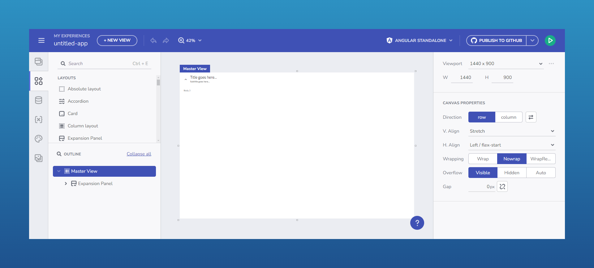

# App Builder SDK を使用した作業の開始

## SDK の概要
App Builder SDK は、フロントエンドとバックエンドの両方の機能をアプリケーションに統合するための包括的なツールキットを提供します。まず、[ヘルプ ドキュメントを使用して](https://github.com/IgniteUI/appbuilder-sdk-sample/blob/main/Documentation/Consuming-AB-SDK-all-in-one-doc.md)、フロントエンド SDK パッケージを使用する Angular ホスト アプリケーションを作成し、シームレスな UI 統合を可能にします。サーバー側では、Visual Studio Code や Visual Studio などの開発環境をサポートする App Builder Backend SDK を使用して、カスタム バックエンドを構築できます。これらの基本的な手順により、アプリケーションは、フロントエンドとバックエンドの両方から SDK の機能を十分に活用できるようになります。

SDK の実行

このドキュメントでは、SDK のセットアップにおける認証および認可の主要な コンポーネントについても詳しく説明します。[OpenID 認証](../on-premises/auth-with-openid-connect-o-auth.md)を構成すると、ユーザーが外部 ID プロバイダーを使用してログインできるようになり、デフォルトの IAM プロバイダーを超える柔軟性が提供されます。さらに、SDK は認可コード + PKCE (Proof Key for Code Exchange) などの外部認証フローをサポートしており、ホスト アプリケーションが認証を直接管理できます。より高度なシナリオでは、IAuthUserService および IPermissionsService インターフェイスをカスタマイズして、ユーザーのロールとアクセス許可に合わせた独自のロジックを実装できます。オプションのガイドは、ロールベースのアクセス制御を適用した、安全でスケーラブルな統合を保証するバックエンド エンドポイントを構成するのに役立ちます。

## その他のリソース

* [App Builder インターフェイスの概要](../interface-overview.md)
* [単一ページとナビゲーション](../single-page-apps-and-navigation.md)
* [App Builder コンポーネント](../indigo-design-app-builder-components.md)
* [Desktop アプリの実行方法](../running-desktop-app.md)