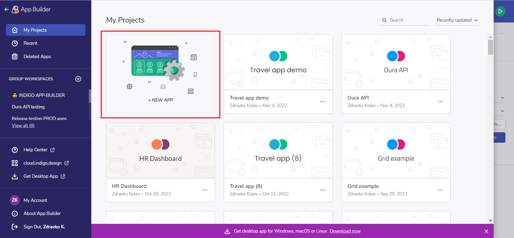

## Sketch UI キット

ここ数年で、デザインからコードへの強力な動きが生まれ、Sketch が中断したところから再開しました。目標は、Sketch のデザインを使用可能なコードに簡単に変換できるようにする、シームレスで一貫性のある使いやすいプロセスを作成することです。

> [!NOTE]
> [Adobe XD UI キット](https://dl.infragistics.com/products/Infragistics/Indigo.Design/ABECAC7231EE434C8CD3DC619BE6F75B/Infragistics_IndigoDesign_UI_Kit.zip)、[Sketch 用プラグイン](https://dl.infragistics.com/products/Infragistics/Indigo.Design/9EB45F5BB4B3442F8B4CECB3EB403063/Infragistics_IndigoDesign_Sketch_Plugin.zip)、および[サンプル アプリ](https://dl.infragistics.com/products/Infragistics/Indigo.Design/Samples/Infragistics_IndigoDesign_Sample_Apps.zip)をダウンロード。

## App Builder Sketch インポーター
以下は、App Builder を使ってドラッグアンドドロップでデザインからコードを作成する 4 つの簡単な手順です。

手順 1: Indigo.Design アプリのホーム画面で [新しいアプリ] をクリックします。
Sketch Design から新しい Angular アプリを作成します。

新しいアプリのダイアログ

手順 2: Sketch ファイルを [既存のデザインから作成] ドロップ領域にドラッグします。
Sketch から Angular へのドラッグ アンド ドロップ

デザインのインポート ダイアログ

手順 3: Cloud IDE でデザインを確認します。
Sketch の Web App Builder のアプリ

コードの生成

手順 4: Angular コードを確認またはダウンロードします。
IDE の右上にあるボタンを使用して、アプリを生成するか、アプリをプレビューしてコードを確認するかを選択できます。こちらでは、実行中のアプリと HTML、CSS、または TypeScript のコードで [プレビュー] オプションを確認できます。

コードの生成

そんな簡単に、デザインまたは開発者は、Web ベースの WYSIWYG ツールを使用して、Sketch からコードを作成できます。チームは、クラウドベースの WYSIWYG ドラッグ アンド ドロップで非常に優れた実際のアプリをデザインおよび構築し、コードを取得できます。これには、Web レイアウト、CSS、およびデータさえも完備しています。

## Sketch アセットのダウンロード 

Sketch プラグイン、UI キット、およびサンプル アプリは、[アセットのダウンロード ページ](https://cloud.indigo.design/resources/sketch)からダウンロードできます。

または、以下の直接リンクから:
- [Sketch UI キット](https://dl.infragistics.com/products/Infragistics/Indigo.Design/ABECAC7231EE434C8CD3DC619BE6F75B/Infragistics_IndigoDesign_UI_Kit.zip)
- [Sketch 用プラグイン](https://dl.infragistics.com/products/Infragistics/Indigo.Design/9EB45F5BB4B3442F8B4CECB3EB403063/Infragistics_IndigoDesign_Sketch_Plugin.zip)
- [サンプル アプリ](https://dl.infragistics.com/products/Infragistics/Indigo.Design/Samples/Infragistics_IndigoDesign_Sample_Apps.zip)

## その他のリソース

* [デザインからコード作成へのストーリー](../design-to-code-story.md)
* [Figma UI キット](figma.md)
* [Adobe XD UI キット](adobe-xd.md)
