# データ機能の概要
App Builder のデータ機能を使用して、開発中のアプリケーションで外部データソースを追加、編集、使用できます。デフォルトで、App Builder には、ユーザーが参照に使用できる Northwind データ ソースが含まれています。以下は、REST API データ ソースを設定するさまざまな方法を示しています。
- データ ソースで REST API URL を使用します。
- Swagger URL またはファイル定義 (json/yaml) を使用します。

> [!WARNING]
> ファイルのアップロードで JSON タイプのデータ ソースを使用することは非推奨になりました。

「.json ファイルのアップロード」機能が削除される前にアプリケーションでデータ ソースをアップロードした場合、「'X' から取得できませんでした。モック データ応答に切り替えます。」という要求が通知されます。


<p style="text-align:center;">以前アップロードされたファイルからデータを取得できませんでした</p>

追加されたすべてのデータ ソースはデータ ツールボックスに配置され、ユーザーは各データ ソースを展開/縮小して、含まれているテーブルおよび選択したフィールドを表示できます。

App Builder は、**応答オブジェクト内のネストされたコレクション**もサポートします。戻り値のコレクションをメタデータ オブジェクト (oData など) でラップする API を取り込み、Grid などのデータ バインディングコンポーネントにネスト コレクションを使用したり、それに基づいて繰り返し操作を実行したりできます。


<p style="text-align:center;">ネストされたコレクションのデモ</p>

## データ ソースを追加する
App Builder のデータ機能により、ユーザーは公開されている外部ソース (Rest API) にリンクできます。

> [!NOTE]
> App Builder に追加されたデータ ソースはユーザー スペースに制限され、追加したユーザーまたはチーム スペース (チーム機能が利用可能な場合) のみに表示されます。


<p style="text-align:center;">URL からデータ ソースを追加する</p>

## Swagger データ ソースを追加する
Swagger ツールの機能は、RESTful API 設計の業界標準である OpenAP I仕様から始まります。

Swagger 定義 (ファイル URL の提供またはファイルのアップロード) を指定できるようになりました。また、直感的なデザインにより、データ フィールドとエンドポイントを簡単に選択できます。Grid、Card、List、またはその他のバインド可能なコンポーネントにこのデータ ソースをバインドできます。

[Swagger の定義を追加してデータをバインドする方法についての全記事](open-api-swagger-support.md) を参照してください。

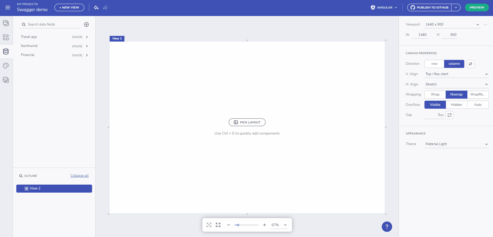
<p style="text-align:center;">Swagger のデモ</p>

## ローカル ネットワーク ソースからのデータ ソースの使用
これで、ローカル ホストまたはプライベート ネットワークにリクエストを送信できます。これには、通常の REST エンドポイントと Swagger エンドポイントが含まれます。

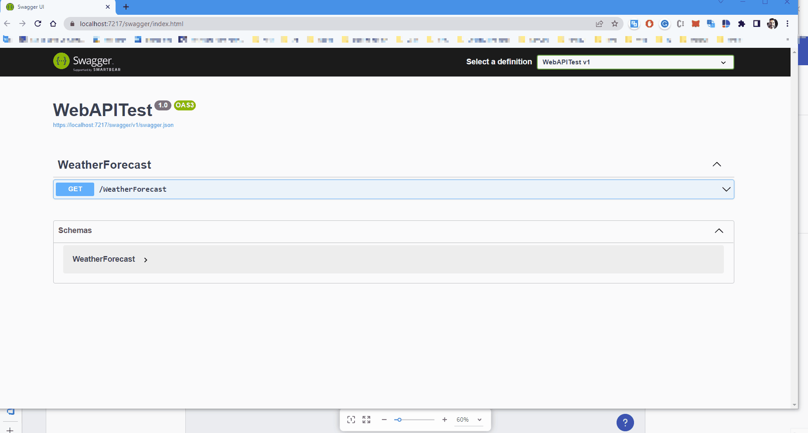
<p style="text-align:center;">ローカル ネットワーク ソースの使用</p>

<div style="font-size: 2em; margin-top: 0.83em; margin-bottom: 0.83em; margin-left: 0; margin-right: 0; font-weight: bold;">トラブルシューティング</div>

プライベート ネットワークの使用中にエラー ダイアログが表示された場合は、このセクションが問題の解決に役立ちます。問題が解決しない場合は、[問題の報告またはフィードバックの送信](getting-started.md#問題の報告またはフィードバックの送信)セクションに従ってください。
### [リクエストは失敗しました!] エラー ダイアログ
ローカル ネットワークでの作業の本質により、このタイプのエラーでは、CORS の問題 (クロスオリジン) などが原因でローカル / プライベート サービスが失敗したかどうかを識別するために、追加の作業が必要になります。


ローカル サービスの追加中に [リクエストは失敗しました!] ダイアログが表示された場合は、ブラウザーの開発ツールを開き (`F12`）、コンソール / ネットワーク タブでエラーを確認します。最も可能性の高い理由は、CORS の制限です。

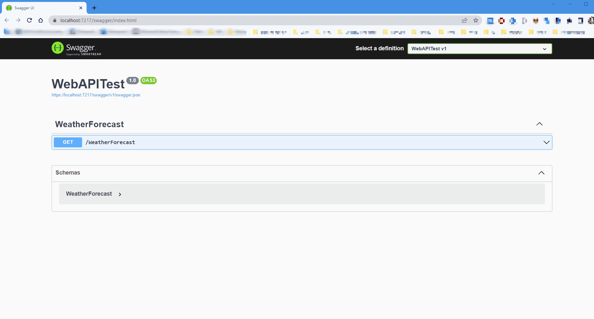
<p style="text-align:center;">[リクエストは失敗しました!] エラー </p>

ローカル サービスの構成に基づいて、クロスオリジン リクエストの問題を解決する方法がいくつかあります。これについては、以下で詳しく説明します。

### ASP.NET Core でクロスオリジン リクエスト (CORS) を有効にする

[この記事](https://docs.microsoft.com/ja-jp/aspnet/core/security/cors?view=aspnetcore-6.0)は、ASP.NET Core アプリで CORS を有効にする方法を示しています。Web App Builder が、すべてまたは特定のオリジンを許可する CORS ポリシーを追加するようにすることができます:

```
var builder = WebApplication.CreateBuilder(args);
var MyAllowSpecificOrigins = "_myAllowSpecificOrigins";

// Add services to the container.
builder.Services.AddControllers();

builder.Services.AddEndpointsApiExplorer();
builder.Services.AddSwaggerGen();
builder.Services.AddCors(options =>
{
    options.AddPolicy(name: MyAllowSpecificOrigins,
                      policy =>
                      {
                          policy.AllowAnyOrigin();
                      });
});
```

`app` の初期化の直後に .UseCors() を設定します。

```
var app = builder.Build();

app.UseCors(MyAllowSpecificOrigins);

// Configure the HTTP request pipeline.
if (app.Environment.IsDevelopment())
{
    app.UseSwagger();
    app.UseSwaggerUI();
}
```

### IIS マネージャー、web.config、または C# を使用して CORS を有効にする

IIS を使用して内部でホストされているデータ ソースにアクセスできるようにするには、以下の手順に従います:

1. サーバーまたはローカル PC で IIS マネージャーを開きます。
2. 応答ヘッダーを編集する必要がある Web サイトに移動します。
3. 下の画像に示すように、編集しているサイトに関連するリストまたはアイコンから、中央のペインから [HTTP 応答ヘッダー] を選択します。
4. [HTTP 応答ヘッダー] をダブル クリックします。
5. 次に、右側のペインから [追加] をクリックします。
6. ダイアログ ボックスが開きます。[名前] には「Access-Control-Allow-Origin」と入力し、[値] にはアスタリスク (*) を入力します。
7. [OK] をクリックします。これで完了です。

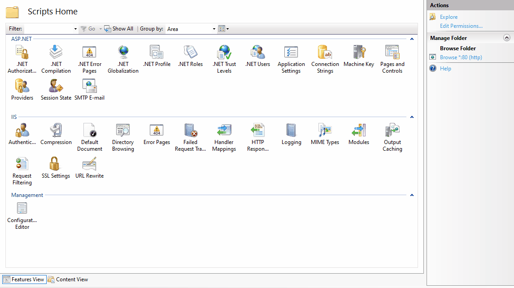
<p style="text-align:center;">IIS 構成</p>

CORS を有効にするには、asp.net Web サイトの web.config ファイルに構成を追加するか、global.asax ファイルにコードを追加します。詳細情報は[ここ (英語)](https://qawithexperts.com/article/asp-net/enabling-cors-in-iis-various-possible-methods/291)にあります。

## OpenAPI (Swagger) エンドポイントはグレー表示される

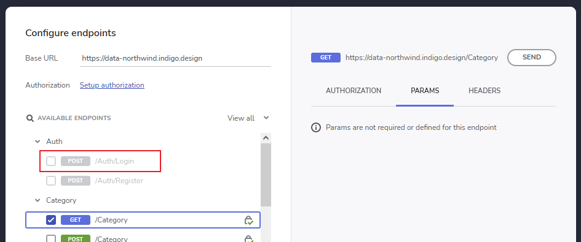

これは通常、エンドポイントに定義された応答がないか、応答型が未対応であることを意味します。

API が適切な応答記述を作成するのに十分な情報を Swagger に提供しない場合に発生する可能性があります。

App Builder で動作しないエンドポイントの例は以下のとおりです:
  
  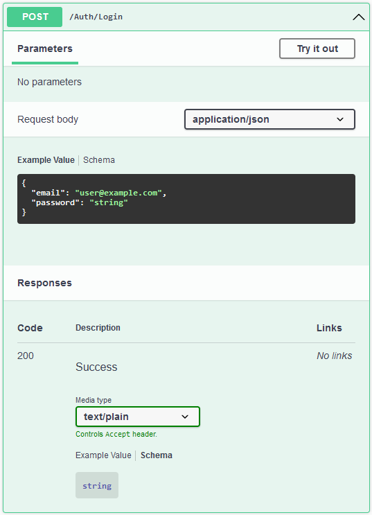

  `200` の "text" 応答が記述されており、その中に他の型情報がないことに注意してください。

App Builder で動作するのに十分な情報を持つエンドポイントの例は以下のとおりです:

  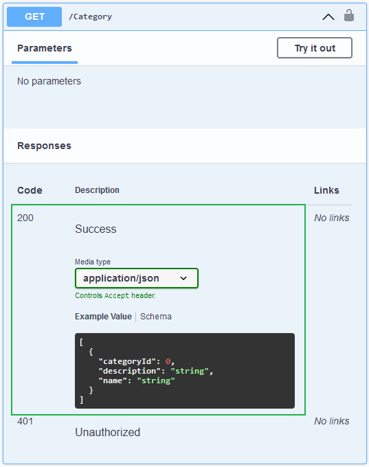

  エンドポイントは、戻り値の型の例とともに `200` 応答を記述していることに注意してください。

### .Net Controller API での応答の記述

```csharp
      // Wrong: it doesn't provide enough information to describe the response type as it's not using generics
      [HttpGet]
      public async Task<ActionResult> GetCategories()
      {
         return Ok(await categoriesService.GetCategories());
      }

      // Good: it describes the return type using generics
      [HttpGet]
      public async Task<ActionResult<IEnumerable<Category>>> GetCategories()
      {
         return Ok(await categoriesService.GetCategories());
      }
```

### .Net Minimal API での応答の記述

```csharp
      // Wrong: it doesn't provide enough information to describe the response type as Results.Ok() is not generic
      app.MapGet("/category", async () => Results.Ok(await categoriesService.GetCategories()));

      // Good: It's using `TypedResults`
      app.MapGet("/category", async () => TypedResults.Ok(await categoriesService.GetCategories()));

      // Good: It describes the response type with `.Produces<>()`
      app.MapGet("/category", async () => Results.Ok(await categoriesService.GetCategories()))
         .Produces<IEnumerable<Category>>();

      // Good: It's returning the raw generic object (not wrapped in Result)
      app.MapGet("/category", async () => await categoriesService.GetCategories());
```

## データ フィールドの選択とフィールド タイプの変更
データ ソースが追加されると、ユーザーは特定のデータ フィールドをコンポーネント セクションに接続できます。これを行うには、最初にコンポーネント (以下の例では Card コンポーネントを使用) を選択し、[繰り返し] モードを [Data] に変更してメニューをスクロールダウンし、接続するデータ ソースからテーブルを見つけて選択します。最後に、Card セクションを選択したテーブル フィールドに接続します。


<p style="text-align:center;">データ フィールドを選択する</p>


<p style="text-align:center;">データ ソース テーブルのフィールド タイプを変更する</p>

## データ ソースを繰り返しコンポーネントに接続する
データ ソースが追加されると、ユーザーは特定のデータ フィールドをコンポーネント セクションに接続できます。これを行うには、最初にコンポーネント (以下の例では Card コンポーネントを使用) を選択し、[繰り返し] モードを [Data] に変更してメニューをスクロールダウンし、接続するデータ ソースからテーブルを見つけて選択します。最後に、Card セクションを選択したテーブル フィールドに接続します。

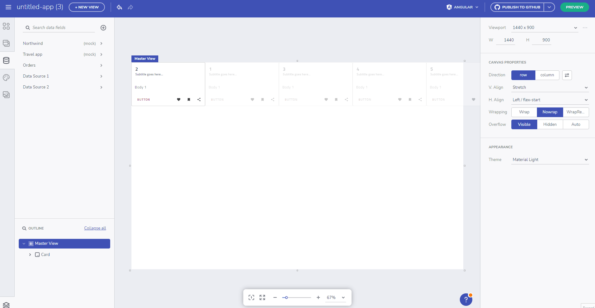
<p style="text-align:center;">データ ソース テーブルのフィールドをコンポーネント セクションに接続する</p>

### 階層バインドのサポート
コンポーネントを階層データ構造にバインドし、ネストされたデータ コンテキスト コレクションをデータの繰り返しでバインドできるようになりました。

Movies -> Cast -> Films の 3 つのデータ レベルを持つ次のデータ ソースを見てみましょう。

```json
{
   "name":"Movies list",
   "movies":[
   {
         "title":"The Dark Knight",
         "cast":[
            {
               "name":"Christian Bale",
               "character":"Bruce Wayne/Batman",
               "films":[
                  {
                     "title":"American Psycho",
                     "role":"Patrick Bateman"
                  },
                  {
                     "title":"The Prestige",
                     "role":"Alfred Borden"
                  }
               ]
            },
            {
               "name":"Heath Ledger",
               "character":"The Joker",
               "films":[
                  {
                     "title":"Brokeback Mountain",
                     "role":"Ennis Del Mar"
                  },
                  {
                     "title":"The Imaginarium of Doctor Parnassus",
                     "role":"Ennis Del Mar"
                  },
                  {
                     "title":"The Imaginarium of Doctor Parnassus",
                     "role":"Tony"
                  }
               ]
            }
         ]
      },
      ...
   ]
}
```

データ コンテキストを使用して、ネストされたデータにリピータをバインドできるようになりました。**Movies -> Cast コレクション**

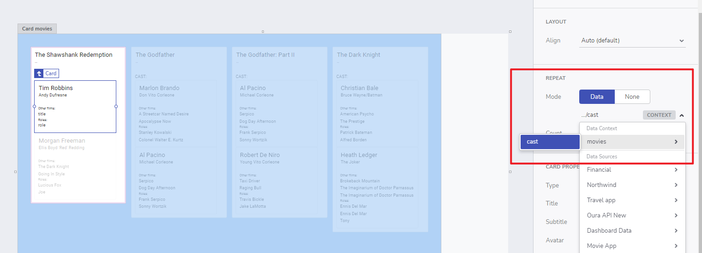
<p style="text-align:center;">データ コンテキスト</p>

さらに 1 段階深く、**Cast -> Films コレクション**に移動できます。

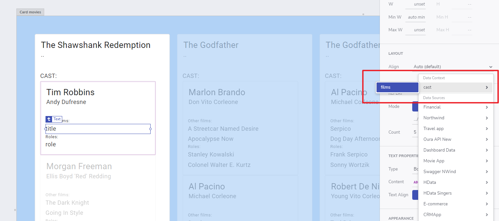
<p style="text-align:center;">1 段階深いデータ コンテキスト</p>

上記の階層データ ソースの最終結果は次のようになります。

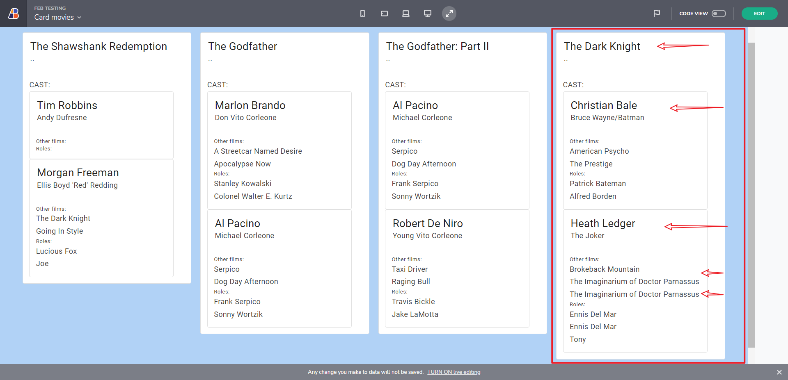
<p style="text-align:center;">階層バインドの結果</p>

Tree やその他のコンテナーなどのコンポーネントにも適用できます。以下の例は、単純な Tree と Tree Grid を階層構造を持つデータ ソースにバインドする方法を示しています。

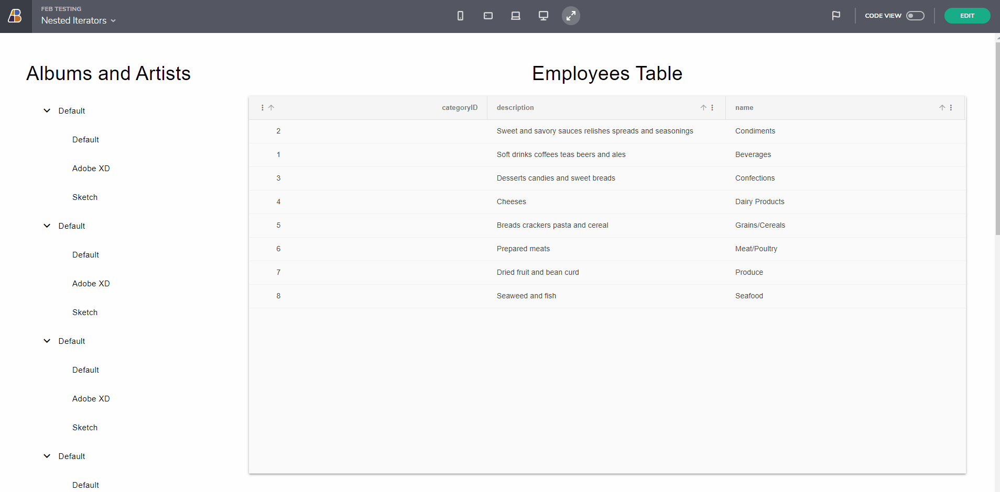
<p style="text-align:center;">ネストされたリピータの例</p>

Tree コンポーネントを確認してみましょう。ルート要素と子要素を特定の階層レベルにバインドするために、繰り返し: Data オプションを使用します。Tree は宣言型コンポーネントであり、(ツリー ルート レベルで) データ入力バインドを持たないため、ノード階層を指定し、階層データ セットを反復処理することによって宣言します。ノードをデータ モデルにバインドして、展開された状態と選択された状態が基になるデータにも反映されるようにすることができます。

## 既知の問題と制限
### データからスキーマを推測できません
このエラー メッセージは、データ ソースの解析されたテーブル スキーマのサイズが大きすぎる (5MB 以上) 場合に表示されます。以下の場合に発生します。

- 通常の REST エンドポイントを追加する場合。
- Swagger データ ソースのエンドポイントをチェックする場合。
- または、データ ソースが更新された場合。

これはデータ量の制限ではありません。たとえば、50MB を超える行があったとしても、*スキーマ (以下の注) が 5MB 未満で表現できていれば、App Builder はそのデータを読み込めます。

> [!NOTE]
> スキーマ: データ ソースのすべてのテーブルのデータの定義


<p style="text-align:center;">データからスキーマを推測できません</p>

## その他のリソース
<div class="divider--half"></div>

* [App Builder コンポーネント](indigo-design-app-builder-components.md)
* [App Builder インターフェイスの概要](interface-overview.md)
* [単一ページとナビゲーション](single-page-apps-and-navigation.md)
* [App Builder コンポーネント](indigo-design-app-builder-components.md)
* [Flex レイアウト](flex-layouts/flex-layouts.md)
* [Desktop アプリの実行方法](running-desktop-app.md)
* [アプリを生成する](generate-app/generate-app-overview.md)