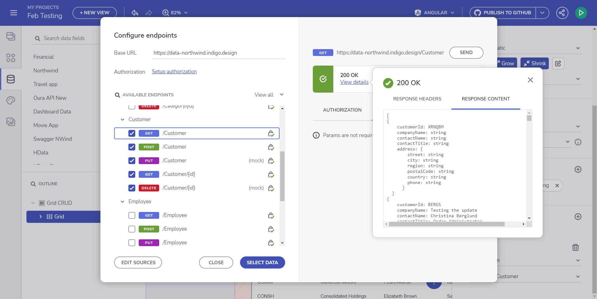
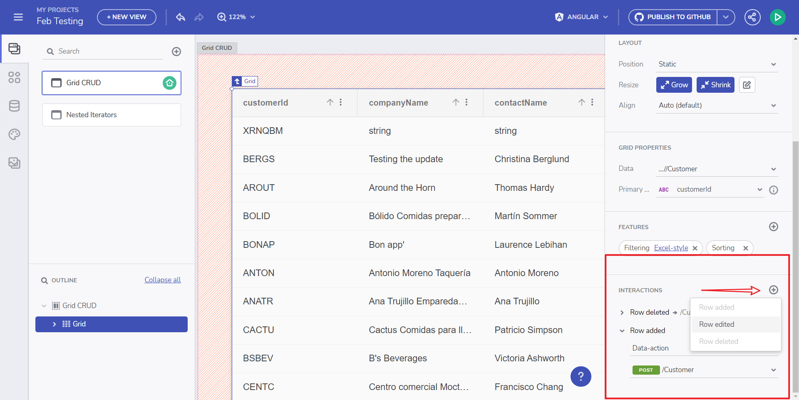
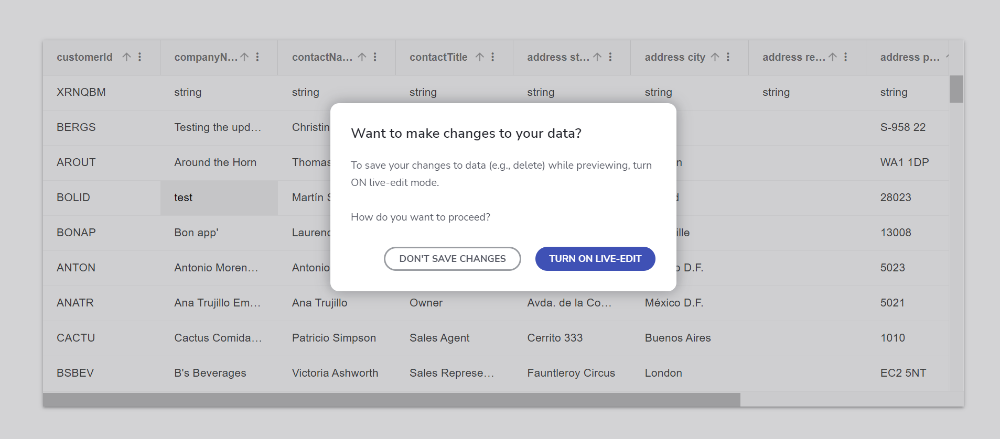
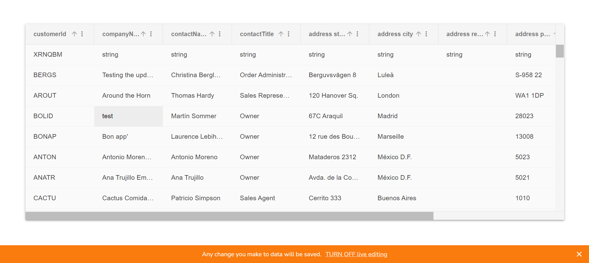

# Grid CRUD

このトピックでは、App Builder の一部としてグリッドで CRUD 操作の使用を開始する方法を示します。

App Builder は、ユーザーがグリッド内から CRUD 操作を実行するための UI を提供するようになりました。グリッドはすぐに使えるセル編集、行編集、行追加、行削除 UI を提供するため、これは非常に簡単です。カスタム [Northwind CRUD API Swagger 定義](https://data-northwind.indigo.design/swagger/v1/swagger.json)と [UI](https://data-northwind.indigo.design/swagger/index.html) ([その他の例はこちら](https://github.com/IgniteUI/app-builder-docfx/wiki/CRUD-API-Examples#northwind-crud-api)) を使用します。

Grid が Customers テーブルにバインドされている場合 (Swagger パスの画像 1)、Data Interactions セクションは、そのような対話を追加すると、Customers で使用可能なメソッドと共に読み込まれます (画像 2)。


<p style="text-align:center;">画像 1: Swagger エンドポイントの設定</p>


<p style="text-align:center;">画像 2: プロパティ パネル -> インタラクション</p>

以下の例では、Northwind Web API サービスを使用して実際にすべての顧客を取得し、**CustomerID** "BERGS" を持つ特定の顧客を選択し、**CompanyName** を "Testing the update" に更新する方法を示します。App Builder は、エンド ユーザーがプロンプト ウィンドウ (ライブ編集をオンにする) で許可した場合、リモート データを変更する実際のデータ リクエストを行うことができます。アプリのプレビューには 2 つのデータ アクセス状態があることに注意してください。ワークスペースの**編集者/認証済みユーザー**の部分は、リアルタイムの変更状態で直接プロンプトが表示されます (以下の画像を参照)。**閲覧者/ワークスペースに参加していないユーザー**には、実際の Web API へのアクセス権がなく、代わりにモック データを使用することが通知されます。


<p style="text-align:center;">ライブ編集をオンにする</p>

ページの下部に通知バーが表示され、変更を行うと実際にリモート データが更新されることをエンド ユーザーに警告します。**[ライブ編集をオフにする]** アクション ボタンを使用して、その機能をオフにすることができます。



<p style="text-align:center;">ライブ編集をオフにする</p>

## Grid CRUD デモ

これは、実際の CRUD プロセス全体です。


<p style="text-align:center;">Grid CRUD 操作</p>

アプリケーション用に生成されたコードは次のようになります。これは、CRUD 操作ごとに設定される Web API 呼び出しを介して、アプリケーションがデータ層に直接アクセスする方法です。

CRUD 操作は、HTTP を介した API との通信に使用される HTTP メソッドにも概念的に対応していることに注意してください。

```ts
export class SwaggerNWindService {
  constructor(private http: HttpClient) { }

  public postCustomer(data: any): Observable<any> {
    const options = {
      headers: {
        Authorization: 'Bearer <auth_value>',
      },
    };
    const body = data;
    return this.http.post(`${API_ENDPOINT}/Customer`, body, options);
  }
  public putCustomer(data: any): Observable<any> {
    const options = {
      headers: {
        Authorization: 'Bearer <auth_value>',
      },
    };
    const body = data;
    return this.http.put(`${API_ENDPOINT}/Customer`, body, options);
  }
  public deleteCustomer(id: string): Observable<any> {
    const options = {
      headers: {
        Authorization: 'Bearer <auth_value>',
      },
    };
    return this.http.delete(`${API_ENDPOINT}/Customer/${id}`, options);
  }
  public getCustomer(): Observable<any> {
    const options = {
      headers: {
        Authorization: 'Bearer <auth_value>',
      },
    };
    return this.http.get(`${API_ENDPOINT}/Customer`, options);
  }
}
```

同じデータベースに対して CRUD 操作を実行する必要があるコンポーネントで再利用できるサービスを生成します。そのようなサービスを可能な限り汎用的に記述することをお勧めします。これにより、多くのコンポーネントで再利用したり、異なるサーバーに対しても再利用したりできます。

## 既知の問題と制限

- Open API エンドポイントでのみ機能します。
- data-actions は、最大 1 つのパラメーターをサポートします。
- `RowDeleted` イベントの場合、パラメーター値は選択されたグリッド行の `PrimaryKey` 値になります。
- `RowAdded` および `RowUpdated` イベントの場合、パラメーター値は、選択されたグリッド行にバインドされたオブジェクトになります。

## その他のリソース

<div class="divider--half"></div>

- [App Builder コンポーネント](../indigo-design-app-builder-components.md)
- [App Builder インターフェイスの概要](../interface-overview.md)
- [単一ページとナビゲーション](../single-page-apps-and-navigation.md)
- [App Builder コンポーネント](../indigo-design-app-builder-components.md)
- [Flex レイアウト](../flex-layouts/flex-layouts.md)
- [Desktop アプリの実行方法](../running-desktop-app.md)
