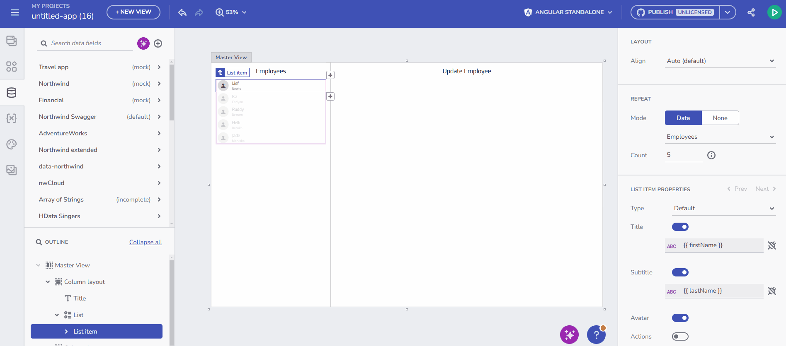
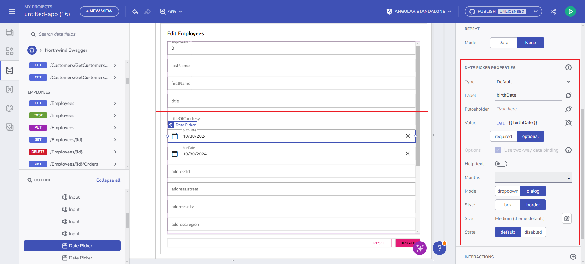
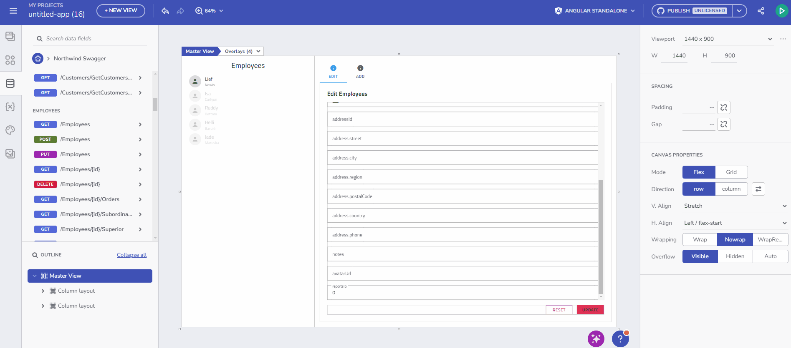
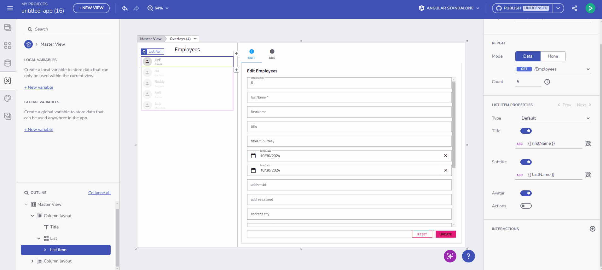
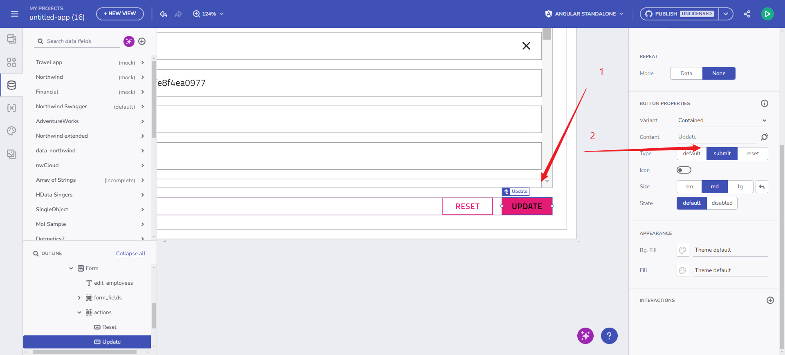

# フォーム ビルダーの概要
App Builder のフォーム ビルダー機能を使用すると、開発者はドラッグ アンド ドロップ操作で HTML フォームを設計できます。API エンドポイントから直接フォーム構造を自動生成することに重点を置き、作成プロセスを簡素化し、バックエンド ソースとのシームレスなデータ接続を可能にします。この機能は、フォームのレイアウト、コンポーネントのカスタマイズにおいて幅広い柔軟性を提供し、送信、エラー、サーバー側の検証に関する通知を表示するオプションも含まれています。

> [!NOTE]
> [プレビュー版環境](https://preview.appbuilder.dev/)にアクセスして、Form Builder の早期プレビューをいち早く体験してください。

## フォーム ビルダーの主な機能
### データ エンドポイントからの自動フォーム生成
データ エンドポイントをデザイン サーフェイスにドラッグすると、エンドポイントのプロパティに基づいてフォーム コンポーネントのセットが自動的に生成されます。
- `POST` および `PUT` メソッドは、データ送信用の入力フィールドを作成します。
- `OnSuccess` や `OnError` インタラクションなどの基本的なイベント処理は自動的に構成されます。

自動フォーム作成

### フォーム コントロールの自動作成とマッピング
フォーム コントロールは、各フィールドのデータ タイプとメタデータに基づいて作成され、直感的な入力とラベルが確保されます (例: 日付フィールドでは**日付ピッカー**が使用され、ブール型フィールドでは**スイッチ**が使用されます)。開発者は、プロパティ パネルでコンポーネントを変更したり、検証を追加したり、ラベルを直接調整したりするための完全な制御を保持します。

フォーム コントロールの自動作成

### フォームの変更
フォームが生成されると、フィールドの追加や除外、ラベルのカスタマイズ、入力検証の設定などの編集が可能になり、直感的なデザイン エクスペリエンスが実現します。App Builder を使用すると、フォームのレイアウトとコンポーネントの両方をカスタマイズできます:
- フォーム内の要素を簡単に追加または削除します。
- *Required* および *Disabled* の検証、ラベルのカスタマイズ、マッピングなどのコントロール プロパティを調整します。

フォームの変更

### フォームとのライブ インタラクション
App Builder のプレビュー モードでは、ユーザーはフォームを操作して次の内容を確認できます:
- リアルタイムの入力検証。
- フォームの送信。成功または検証エラーを示す通知が表示されます。

変数とフォームの初期状態の設定。

> [!NOTE]
> プレビュー モードでフォームを送信すると、`Post/Put` アクションが実行され、指定されたエンドポイントを通じてレコードが追加または更新されます。

### 設定可能なアクション ボタン
アクション ボタン (`Submit`、`Reset`) は完全なカスタマイズが可能で、フォーム内と外部の両方の配置をサポートします。開発者が複雑なレイアウトでフォームの挙動を正確に制御するために、この柔軟性は不可欠です。

アクション ボタンの設定

### アクション通知の送信
成功メッセージとエラー メッセージはスナックバーを介して表示され、フォームの送信に関する邪魔にならないフィードバックを提供します。これらの通知は最初のリリースではハードコードされていますが、将来のリリースでは柔軟なインタラクション処理をサポートする予定です。

## フォーム コントロールのサポート
フォーム ビルダーは、特定のデータ タイプにマップされたさまざまな UI コントロールをサポートしているため、開発者はアクセスしやすく応答性の高いフォームを効率的に作成できます。以下に、サポートされているコントロールと現在の制限の概要を示します。

| フォーム コントロール  | デフォルトのタイプ  | 注                                    |
|---------------|---------------|------------------------------------------|
| Radio Group   | ブール値       | 必須フィールドの検証がありません。          |
| Checkbox      | ブール値       | 必須フィールドの検証がありません。          |
| Switch        | ブール値       | -                                        |
| Slider        | 数値        | -                                        |
| Select        | 列挙型          | -                                        |
| Combo Box     | 列挙型          | -                                        |
| Date Picker   | 日付          | -                                        |
| Calendar      | 日付          | 選択した日付が正確に更新されない場合があります。 |
| Input Field   | 文字列、数値| -                                        |

> [!NOTE]
> フォーム コントロールは現在、基本的な検証プロパティ (`Required`、`Disabled`) をサポートしています。

すべてのフォーム コントロールは双方向バインディングをサポートし、フォーム コンテキストにバインドされます。

## 将来の機能強化
App Builder のフォーム ビルダーのロードマップには、手動フォーム作成、検証オプション、拡張メタデータ サポート、通知およびインタラクション処理といった強化が含まれています。

将来の検証機能の強化には以下が含まれます:
- 範囲の検証 (`min`、`max`)。
- 文字列の長さの検証 (`min length`、`max length`)。
- パターン検証 (正規表現)。
- 選択およびコンボ ボックス コントロールの列挙型検証。

## 既知の問題と制限
10 月 28 日にリリースされたフォーム ビルダーの初期リリースには、次の既知の問題と制限が適用されます。

- App Builder ランタイム エクスペリエンスと生成されたアプリケーション ランタイム間の**フォーム リセット動作**の不一致:
    - App Builder では、[リセット] ボタンをクリックすると、レコードを編集するときに初期値に戻り、新しいレコードを追加するときにフォームがクリアされます。
    - 生成されたアプリケーションでは、[リセット] ボタンをクリックすると、すべてのフォーム コントロールが空の値に設定され、フォームがクリアされます。
- **フォームのコピー / 貼り付け**: 現在、フォームをコピーして貼り付けると、元のフォームのデータ バインディングが失われ、新しく貼り付けたフォーム インスタンスに転送されます。
- **ブール必須フラグ**: 特に「利用規約に同意する」などの場合には、必須のブールフィールドを実装する際に曖昧さが生じます。
- **送信/リセット動作**: 送信/リセット機能は、テンプレート フォームとリアクティブ フォームの両方で動作するように調整されていますが、依然として不整合が発生する可能性があります。
- **コードの生成**:
    - **フォーム モデルの型付けの問題**: 特にネストされた構造や配列を扱う場合には、型の不一致が発生する可能性があり、出力コードでの正確なフォーム モデルの生成が複雑になります。
    - **`igx-hint` - プレビューの要素**: `igx-hint` 要素は最終コードでは生成されないため、現在プレビューから除外されています。将来の更新では、メッセージ表示機能のサポートが追加される可能性があります。

## その他のリソース

* [App Builder コンポーネント](../indigo-design-app-builder-components.md)
* [App Builder インターフェイスの概要](../interface-overview.md)
* [単一ページとナビゲーション](../single-page-apps-and-navigation.md)
* [Flex レイアウト](../flex-layouts/flex-layouts.md)
* [Desktop アプリの実行方法](../running-desktop-app.md)
