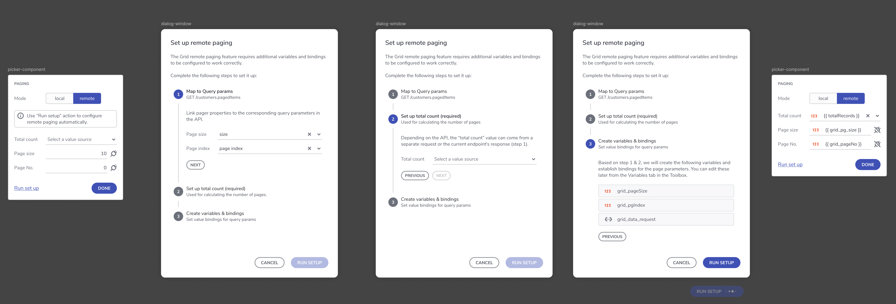

# グリッド リモート ページング
リモート ページングは、必要に応じてサーバーからデータの一部のみを取得して、グリッドがデータを動的に読み込んで表示する機能です。これにより、すべてのレコードを一度に取得する必要がなくなるため、特に大規模なデータセットのパフォーマンスが向上します。

## リモートページングの主な利点
- **パフォーマンスの改善:** 必要なデータのみ読み込むため、読み込み時間を削減します。
- **スケール可能:** 大規模なデータセットを効率的に処理します。
- **ユーザーコントロール:** 開発者とユーザーにデータの表示方法に柔軟性を提供します。

## リモートページングの仕組み

リモート ページングは、データをリモート サーバーから個別に要求される「ページ」に分割します。これにより、一度に必要なデータ スライスのみが読み込まれるようになります。ツールに組み込まれているプロパティを使用して、**グリッド** コンポーネントと**ツリー グリッド** コンポーネントの両方に対して構成できます。

ユーザーはコンフィギュレータを使用して、リモート ページングが機能するために必要なすべてのものを設定します。必要なもの
- `pageIndex` - データが取得されるページのインデックス。このパラメーターが指定されていない場合、ページのインデックスはデフォルトで 0 になり、データの最初のページが取得されます。
- `pageSize` - ページごとに取得して表示するレコードの最大数。このパラメーターが指定されていない場合、すべてのレコードが取得され、ページの合計数は 1 になります。
- `totalRecords` - サーバーで利用可能なレコードの合計数を返します。この数値は、ページネーターがページの合計数を計算するために必要です。

**ユーザー フロー:**


<p style="text-align:center;">ユーザー フローのコンフィギュレーター</p>

## ユーザー設定

リモート ページングは、API がデータと合計レコード数を処理する方法に応じて、2 つのアプローチに従って実装できます。

1. **データと合計レコード数の複合エンドポイントを使用する方法**  
この場合、API はページングされたデータとレコードの合計数の両方を 1 回の応答で返します。

2. **データと合計レコード数に別々のエンドポイントを使用する方法**  
この設定では、ページングされたデータを取得するための API 呼び出しと、合計レコード数を取得するための API 呼び出しの 2 つが行われます。

### 単一のエンドポイント
サポートされているデータ構造の例は次のとおりです。

```
{
  "items": [
    {
      "categoryId": 0,
      "description": "string",
      "name": "string"
    }
  ],
  "totalRecordsCount": 0,
  "pageSize": 0,
  "pageNumber": 0,
  "totalPages": 0
}

```
**手順:**
1. グリッドを、Items (項目) コレクションと Total Records Count (合計レコード数) フィールドを持つ Object (オブジェクト)を返すエンドポイントにフックします。このオブジェクトは、項目のコレクションと合計レコード数を提供します。
2. リモート ページング機能を追加し、**リモート** ページング モードを選択して構成ダイアログを読み込みます。
3. ページング構成ダイアログで、合計レコード数に対応するフィールド プロパティを選択します。上記の例では、「totalRecordsCount」 になります。
4. **ページング構成ダイアログ**で、**ページ インデックス**に使用するクエリ パラメーターと**ページ サイズ**に使用するクエリ パラメーターを指定します。
5. [保存] をクリックします。

**結果:**
- **ページ インデックス**と**ページ サイズ**の両方の値を格納するための、数値型の 2 つの変数が作成されます。
- **グリッド データ コンテキスト**を格納するための 3 番目の変数が作成されます。データ リクエストから初期化される **Object type** (オブジェクト タイプ)。リクエスト クエリ パラメーターは、ページ インデックスとページ サイズ変数にバインドされます。
- グリッドは、3 番目の変数データ コンテキスト result -> _result.items_ コレクションにバインドされます。
- 合計レコード数は _result.totalRecordsCount_ フィールドにバインドされます。
- **PerPageChanged** と **PageChange** の 2 つのインタラクションが自動的に作成されます。
   - **PerPageChange** の **Source** (値) は、igx-paginator によって提供されるイベント コンテキストからのページ サイズに設定されます。**ターゲット**変数は**ページ サイズ**になります。
   - **PageChange** の Source (値) は、igx-paginator によって提供されるイベント コンテキストからのページ インデックス (現在のページ) に設定されます。  **ターゲット**変数は**ページ インデックス**になります。

**動作:**
プレビューでは、初期ロードは 1 つのリクエストのみ実行されます。ページが変更されるか、ページごとに値が変更されると、新しいページとサイズの値に基づいてデータを取得するための新しいリクエストが行われます。

### 2つの異なるエンドポイント

**手順:**
1. グリッドの `Data` プロパティを、Page および Size クエリ パラメーターを必要とするエンドポイントにバインドします。
2. リモート ページング機能を追加し、**リモート** ページング モードを選択して構成ダイアログを読み込みます。
3. totalRecordsCount を、合計レコード数のみを返す別のエンドポイント (グリッドの `Data` プロパティとは異なる) にフックします。
4. **ページング構成ダイアログ**で、**ページ インデックス**に使用するクエリ パラメーターと**ページ サイズ**に使用するクエリ パラメーターを指定します。
5. [保存] をクリックします。

**結果:**
- **ページ インデックス**と**ページ サイズ**の両方の値を格納するための、数値型の 2 つの変数が作成されます。
- グリッドのデータ ソースには、新しく作成された 2 つの変数にバインドされたクエリ パラメーターが含まれます。
- **合計レコード数**を格納するための 3 番目の変数が作成されます。データ リクエストから初期化される **Object type** (オブジェクト タイプ)。(注意: 現在、App Builder はプリミティブ結果型をサポートしていません)
- **PerPageChanged** と **PageChange** の 2 つのインタラクションが自動的に作成されます。
   - **PerPageChange** の **Source** (値) は、igx-paginator によって提供されるイベント コンテキストからのページ サイズに設定されます。**ターゲット**変数は**ページ サイズ**になります。
   - **PageChange** の Source (値) は、igx-paginator によって提供されるイベント コンテキストからのページ インデックス (現在のページ) に設定されます。  **ターゲット**変数は**ページ インデックス**になります。

**動作:**
- プレビューに移動すると、初期ロードで 2 つのリクエストが実行されます。1 つはグリッドスライスされたデータ用、もう 1 つは合計レコード数用です。その後、ページの変更時またはページの変更ごとに、グリッドスライスされたデータに対して 1 つのリクエストのみが行われます。

## 既知の制限
ユーザーがコンフィギュレーターを使用してリモート ページングを設定し、再度実行すると、API エンドポイントから初期化された冗長な変数はそのまま残ります。

## その他のリソース

<div class="divider--half"></div>

* [App Builder コンポーネント](../indigo-design-app-builder-components.md)
* [App Builder インターフェイスの概要](../interface-overview.md)
* [単一ページとナビゲーション](../single-page-apps-and-navigation.md)
* [App Builder コンポーネント](../indigo-design-app-builder-components.md)
* [Flex レイアウト](../flex-layouts/flex-layouts.md)
* [Desktop アプリの実行方法](../running-desktop-app.md)


