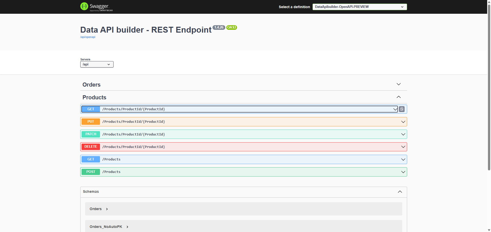

# クイックスタート: Microsoft のデータ API ビルダーで App Builder を任意のデータベースに使用する

このガイドでは、データ API ビルダーを任意のデータベースでセットアップして使用するための手順を段階的に説明します。サポートされているデータベースの[完全なリスト](https://learn.microsoft.com/ja-jp/azure/data-api-builder/overview) (SQL Server、MySQL、PostgreSQL など) も示します。ネイティブ OpenAPI、Swagger for REST エンドポイントを作成し、データベースを効果的に管理するには、次の手順に従ってください。

主要機能

- リレーショナル テーブル、ビュー、ストアド プロシージャーのサポート
- 複数のデータ ソースを同時にサポート
- REST エンドポイント
  - POST、GET、PUT、PATCH、DELETE
  - フィルタリング、並べ替え、ページネーション
  - メモリ内キャッシュ
  - OpenAPI のサポート
- 専用 CLI による簡単な開発
- オープン ソースで無料

この図は、データ API ビルダーのアーキテクチャのすべてのコンポーネント間の関係を詳しく説明しています。


<p style="text-align:center;">DAB アーキテクチャ</p>

---

## 1. NuGet から Microsoft.DataApiBuilder パッケージを .NET ツールとしてインストールします

まず、dotnet tool install を使用して、--global 引数を指定して Microsoft.DataApiBuilder の最新バージョンをインストールします。

```bash
dotnet tool install -g Microsoft.DataApiBuilder
```

> [!NOTE]
> パッケージがすでにインストールされている場合は、代わりに dotnet tool update を使用してパッケージを更新します。

```bash
dotnet tool update --global Microsoft.DataApiBuilder
```

詳細については、[公式ドキュメント](https://learn.microsoft.com/ja-jp/azure/data-api-builder/how-to-install-cli)を参照してください。

## 2. データベースの構成

データベースが設定されていることを確認してください。SQL Server Management Studio、MySQL Workbench、その他のデータベース管理ツールなどのツールを使用して、データベースを作成および構成できます。このガイドでは、MSSQL データベースの例を紹介します。

## 3. 構成ファイルを通じて作成されたデータ API ビルダーの REST エンドポイント

データ API ビルダーは、接続されたデータベースからテーブル、ビュー、ストアド プロシージャにアクセスできる RESTful Web API を提供します。エンティティは、データ API ビルダーのランタイム構成内のデータベース オブジェクトを表します。エンティティを REST API エンドポイントで使用できるようにするには、ランタイム構成でエンティティを設定する必要があります。

それでは、DAB CLI を使用してベースライン構成ファイルを作成しましょう。[公式ドキュメント](https://learn.microsoft.com/ja-jp/azure/data-api-builder/quickstart-sql)。この構成ファイルは、データ API ビルダーがデータベースと対話する方法を定義するために必要です。

次のコマンドを実行して、MSSQL 接続文字列に基づいて構成ファイルを初期化します。

```
dab init --database-type "mssql" --host-mode "Development" --connection-string "Server=DEV-ZKOLEV4\SQLEXPRESS;User Id=INFRAGISTICS/ZKolev;Database=NorthwindCRUD;Integrated Security=True;TrustServerCertificate=True;Encrypt=False;"
```

### REST API が操作するエンティティを追加します

構成ファイルにエンティティ (例: Products) を追加します。

```bash
dab add Products --source "Products" --permissions "anonymous:*"
```

### 現在の dab-config.json 構成ファイルを確認します

ファイルには、単一のエンティティ (REST API エンドポイント) を含む API のベースライン実装が含まれている必要があります。

> [!NOTE]
> 必要に応じて CORS を有効にします (オプション)。クロスオリジン リクエストを許可するには、custom-config.json に次のコードを追加して、構成で CORS を有効にします。

```
"origins": ["*"]
```

```
{
  "$schema": "https://github.com/Azure/data-api-builder/releases/download/v1.4.26/dab.draft.schema.json",
  "data-source": {
    "database-type": "mssql",
    "connection-string": "Server=DEV-ZKOLEV4\\SQLEXPRESS;User Id=INFRAGISTICS/ZKolev;Database=NorthwindCRUD;Integrated Security=True;TrustServerCertificate=True;Encrypt=False;",
    "options": {
      "set-session-context": false
    }
  },
  "runtime": {
    "rest": {
      "enabled": true,
      "path": "/api",
      "request-body-strict": true
    },
    "graphql": { ... },
    "host": {
      "cors": {
        "origins": [
          "*"
        ],
        "allow-credentials": false
      },
      "authentication": {
        "provider": "StaticWebApps"
      },
      "mode": "development"
    }
  },
  "entities": {
    ...
    "Products": {
      "source": {
        "object": "Products",
        "type": "table"
      },
      "graphql": {
        "enabled": true,
        "type": {
          "singular": "Products",
          "plural": "Products"
        }
      },
      "rest": {
        "enabled": true
      },
      "permissions": [
        {
          "role": "anonymous",
          "actions": [
            {
              "action": "*"
            }
          ]
        }
      ]
    }
  }
}
```

## 4. REST API をテストします

次に、データ API ビルダー ツールを起動して、すべてが正しく設定されていることを確認します。

```
dab start
```

出力。API が実行されると、http://localhost:5000/swagger/index.html でアクセスできます。

```
Successfully completed runtime initialization.
info: Microsoft.Hosting.Lifetime[14]
      Now listening on: <http://localhost:5000>
info: Microsoft.Hosting.Lifetime[0]

```

この URL をクリックすると Swagger UI が開き、API エンドポイントをテストできます。


<p style="text-align:center;">Swagger DAB の例</p>

## 6. 新しく作成された REST API で App Builder の使用を開始します

[ステップバイステップのチュートリアル](https://www.appbuilder.dev/ja/help/using-data-in-your-app#swagger-データ-ソースを追加する)については、[このトピック](https://www.appbuilder.dev/ja/help/using-data-in-your-app#swagger-データ-ソースを追加する)を参照してください。


<p style="text-align:center;">App Builder の DAB</p>

## 6.よくある問題のトラブルシューティング

よくある問題とその解決策:

- App Builder では CRUD が Grid でのみ動作します。Form コンポーネントでは、現在進行中の OpenAPI 仕様の一部が不足しているため、完全には動作しません。

- CORS の問題 - CORS を有効にする方法:

```
"host": {
    "cors": {
    "origins": [
        "*"
    ],
    "allow-credentials": false
    },
    "authentication": {
    "provider": "StaticWebApps"
    },
    "mode": "development"
}
```

- OpenID Connect サポート提案 - [data-api-builder GitHub の問題](https://github.com/Azure/data-api-builder/issues/2226)。

- DELETE エンドポイントが機能しない?
エンティティの権限設定で DELETE 操作が有効になっていることを確認してください (例: "anonymous:*" に DELETE が含まれます)。

- 接続文字列の問題
接続文字列内のユーザー名、パスワード、認証方法 (Windows 認証または SQL 認証) を再確認してください。


## その他のリソース

<div class="divider--half"></div>

- [API プロジェクト向けの Query Builder のサポート](api-project-query-builder-support.md)
- [App Builder コンポーネント](../indigo-design-app-builder-components.md)
- [App Builder インターフェイスの概要](../interface-overview.md)
- [フォーム ビルダー](form-builder.md)
- [グリッド リモート ページング](grid-remote-paging.md)
- [CRUD 操作](crud-operations.md)
- [リモート データ操作](remote-data-operations.md)
- [Flex レイアウト](../flex-layouts/flex-layouts.md)
- [Desktop アプリの実行方法](../running-desktop-app.md)
