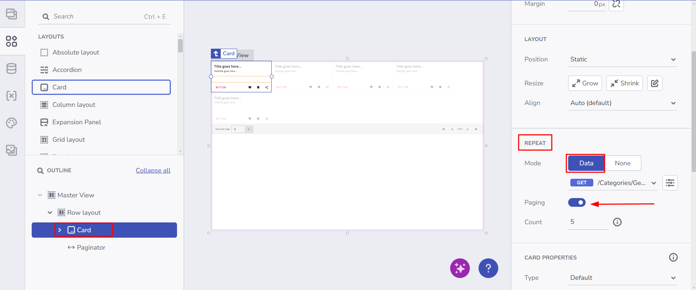

# リモート データ操作

この機能により、ユーザーは **Card** (カード)、**Column Layout** (列レイアウト)、**Absolute Layout** (絶対レイアウト)、**Row Layout** (行レイアウト) コンポーネントを使用してデータを反復処理しながら、Paginator (ページネーター) コンポーネントを活用してデータの特定のページのみを取得するリクエストを構成および実行できます。

## 主な利点
- **パフォーマンスの改善**: 必要なデータのサブセット (ページ) のみをサーバーから取得し、大きなペイロードを回避します。
- **スケール可能**: データを小さなチャンクに分割して読み込むことで、大規模なデータセットを処理します。
- **柔軟性の高い UI**: ユーザーは、ページング機能を活用しながら、カードなどの繰り返し項目をカスタム レイアウトに配置できます。

## コンポーネント優先のリモート データの仕組み

ユーザーがコンポーネントをデータに対して繰り返すよう構成し (例: JSON 配列に対して反復処理する**カード**)、そのデータ ソースにエンドポイント (テーブル) を選択する際に、API がページング可能なエンドポイントを提供している場合は、リモート ページングを構成できます。

**ページング**が有効になっている場合、**ページネーター** コンポーネントが自動的に追加されます。その後、ユーザーは新しく作成された**ページネーター**を選択してリモート ページング コンフィギュレーターを開き、その他のすべての設定を行うことができます。

セットアップ中に、**pageIndex** や **pageSize** などの内部変数が作成されます。ページを変更すると、対応するページのデータのみを取得するための新しいサーバー要求がトリガーされます。

**ユーザー フロー**:

コンポーネント優先のユーザー フロー

## リモート データのセットアップ

### **1.データ上でコンポーネントを繰り返す**
- **ツールボックス**から、**カード**、**列レイアウト**、**絶対レイアウト**、グ**リッド レイアウト**、または**行レイアウト** をドラッグします (現在のところこれらがページングをサポートしています)。
- コンポーネントを選択し、右側に表示される **[プロパティ]** パネルを開きます。

### **2.データの選択**
- **[繰り返し]** の設定で、**[Data]** を選択します。
- JSON 応答を提供する REST エンドポイントまたは Swagger 定義を選択します。
- ページングを行う場合は、選択した API が `pageIndex` や `pageSize` などのパラメーターをサポートし、効果的にページングできることを確認してください。

### **3.ページネーションを有効にする**
- **ページング**をオンに切り替えます。
- App Builder はコンポーネントを**行レイアウト**でラップし、ページネーターがホスト コンポーネント (**カード/レイアウト**) と一緒に正しく配置されるようにします。
- **ページネーター**が追加されるので、それをクリックして独自のプロパティ パネルを開き、設定をする必要があります。設定方法については、こちらをご覧ください: [グリッド リモート ページング](../using-data-in-your-app/grid-remote-paging.md)

### **4.セットアップのプレビュー**
- セットアップが完了し、ローカル変数と操作が生成されたら、コンポーネントのリモート ページングの設定は完了です。
- **[プレビュー]** をクリックして、データの最初のページを読み込みます。
- ページまたはページ サイズを変更すると、新しいリクエストがトリガーされ、必要な部分のデータのみが取得されます。

**期待される結果:**
- コンポーネント (**カード/列レイアウト/行レイアウト/グリッド レイアウト/絶対レイアウト**) はグリッドのようにページネーションされ、現在のページのデータのみを動的に取得します。

## 既知の制限

### **1.行レイアウトの適用**
- **ページネーター**と繰り返しコンポーネントの適切な配置を保証するために、App Builder は、**折り返し**、**拡大**、および「縮小」ルールを有効にして、それらを**行レイアウト**内にラップします。

### **2.変数優先アプローチはまだサポートされていません**
- 現在、ページングを有効にするには、ユーザーはまずデータ上でコンポーネントを繰り返す必要があります。次のバージョンでは、**ページネーター**をスタンドアロン コンポーネントとして公開し、データ要求を独自に構成して、任意のコンポーネントを対応するデータにバインドできるようにする可能性があります。

## その他のリソース

* [App Builder コンポーネント](../indigo-design-app-builder-components.md)
* [App Builder インターフェイスの概要](../interface-overview.md)
* [グリッド リモート ページング](../using-data-in-your-app/grid-remote-paging.md)