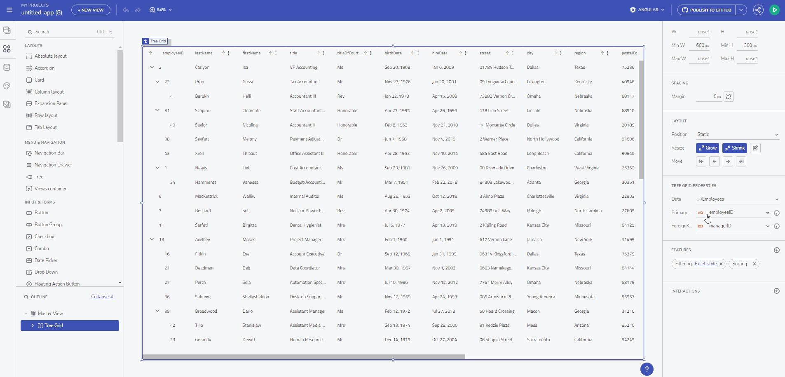

# Web Components による Blazor コード生成

App Builder でサポートされるフレームワークはさらに増えています。最新の追加 - [Web Components](https://jp.infragistics.com/products/ignite-ui-web-components) です。これで、Web コンポーネント アプリケーションを GitHub にダウンロードまたはアップロードできます。

AppBuilder からの Web Components コード生成

> [!NOTE]
><b>まだ利用できないコンポーネントのコードを生成しようとすると、そのようなコンポーネントがまだサポートされていないことを示すプレースホルダーが表示されます。これにより、デザイナーでより複雑な UI を開発することを控える必要はありません。

### トピック コンテンツ:
* <a href="#introduction">機能の紹介</a>
* <a href="#web-components-code-generation">Web Components のコード作成</a>
* <a href="#uploading-an-application-to-github">アプリケーションを Github にアップロードする</a>
* <a href="#known-issues-and-limitations">既知の問題と制限</a>

## 概要
App Builder を使用して次の Web アプリをキックスタートし、高パフォーマンスの Web Components アプリを最速で提供できるようになりました。

最新の Web アプリ向けの最先端の開発ツールを提供するというアイデアにより[、Ignite UI for Web Components ライブラリ](https://jp.infragistics.com/products/ignite-ui-web-components)だけでなく、App Builder で構築された Web アプリを生成する機能も備えています。 

Web Components の概要カスタムで再利用可能なカプセル化された HTML タグを作成して、Web ページや Web アプリで使用できる Web プラットフォーム API のセット。Web コンポーネント標準に基づいて構築されたカスタム コンポーネントとウィジェットは、最新のブラウザーで動作し、HTML で動作する任意の JavaScript ライブラリまたはフレームワークで使用できます。

ただし、Web Components はこれらの技術的なカテゴリには分類されないため、Web コンポーネントをフレームワークやレンダリング ライブラリと混同しないでください。次のように見る方がより適切です:

 - 低レベルのブラウザー API
 - 標準コンポーネント インターフェイス
 - フレームワークに依存しないリッチなユーザー エクスペリエンス

## Web Components のコード作成

App Builder を使用すると、依存関係のないコンポーネントを使用して将来性の高いアプリ開発戦略を活用することで、高度な Web アプリを生成できるようになりました。アプリケーションの準備ができたら、目的のフレームワークを設定します。Web Components ドロップダウン項目が選択されたら、それを生成してダウンロードするために [ZIP のダウンロード] をクリックします。

ダウンロード ボタン

生成されたコードを簡単に確認したい場合は、[アプリ プレビュー] に移動し、[コード ビュー] スイッチを切り替えます。

コードのプレビュー

## アプリケーションを Github にアップロードする
アプリケーションをプレビュー モードで表示したり、ローカルにダウンロードしたりする以外に、完全なアプリコード リポジトリを生成するオプションがあります。これを行うには、[アプリの生成] ボタンに移動し、GitHub アカウントを App Builder に接続します。

## 既知の問題と制限

サポートされているすべてのコンポーネントのリストについては、[アプリの生成](generate-app/generate-app-overview.md#サポートされているコンポーネント)を参照してください。

## その他のリソース

* [アプリの生成](./generate-app/generate-app-overview.md)
* [App Builder コンポーネント](indigo-design-app-builder-components.md)
* [Flex レイアウト](flex-layouts/flex-layouts.md)
* [Desktop アプリの実行方法](running-desktop-app.md)
* [Indigo.Design はじめに](https://jp.infragistics.com/products/indigo-design/help/getting-started)
* [Indigo.Design コンポーネント](https://jp.infragistics.com/products/indigo-design/help/components/components-overview)